Data EDA
================
Yuri Matheus Dias Pereira
17/09/2018

This a Notebook for an Exploratory Data Analysis on the Satellite telemetry data.

``` r
library(tidyverse) # meta-package: everything else
```

    ## ── Attaching packages ─────────────────────────────────────── tidyverse 1.2.1 ──

    ## ✔ ggplot2 3.0.0     ✔ purrr   0.2.5
    ## ✔ tibble  1.4.2     ✔ dplyr   0.7.6
    ## ✔ tidyr   0.8.1     ✔ stringr 1.3.1
    ## ✔ readr   1.1.1     ✔ forcats 0.3.0

    ## ── Conflicts ────────────────────────────────────────── tidyverse_conflicts() ──
    ## ✖ dplyr::filter() masks stats::filter()
    ## ✖ dplyr::lag()    masks stats::lag()

``` r
library(data.table) # Table
```

    ## 
    ## Attaching package: 'data.table'

    ## The following objects are masked from 'package:dplyr':
    ## 
    ##     between, first, last

    ## The following object is masked from 'package:purrr':
    ## 
    ##     transpose

``` r
library(lubridate) # Date
```

    ## 
    ## Attaching package: 'lubridate'

    ## The following objects are masked from 'package:data.table':
    ## 
    ##     hour, isoweek, mday, minute, month, quarter, second, wday,
    ##     week, yday, year

    ## The following object is masked from 'package:base':
    ## 
    ##     date

``` r
library(GGally) # ggplot2 convenience
```

    ## 
    ## Attaching package: 'GGally'

    ## The following object is masked from 'package:dplyr':
    ## 
    ##     nasa

``` r
library(parallel) # Threads counts
library(fst) # File reading
library(gridExtra) # Plot grids
```

    ## 
    ## Attaching package: 'gridExtra'

    ## The following object is masked from 'package:dplyr':
    ## 
    ##     combine

Reading the Data
================

Let's import the prepared telemetries description table now, along with some useful functions and constants defined in `reading_telemetry.R`:

``` r
root.dir <- "../"
source(paste0(root.dir, "R/reading_telemetry.R"))
DATA_DIR <- paste0(root.dir, "Data/")
TELEMETRY_FST_PATH <- paste0(DATA_DIR, "sat2_2018-03.fst")
sat2_TELEMETRIES_DESC_FILE <- paste0(DATA_DIR, "telemetryDescription.csv")

telemetries <- read.telemetries.description(sat2_TELEMETRIES_DESC_FILE)
sat2 <- read.telemetry.fst(TELEMETRY_FST_PATH)
```

This file will prove really useful, however...

``` r
allTelemetries <- telemetries[, ID]
observedTelemetries <- names(sat2[,-c('date', 'CheckCRC')])
extraTelemetries <- observedTelemetries[
  !observedTelemetries %in% allTelemetries
]
extraTelemetries
```

    ## [1] "TM352" "TM353" "TM354" "TM355"

This indicates that we have observed telemetries that are different from the actual documentation of the satellite.

Let's see how it looks like:

``` r
telemetries[,.(.N), by = .(SYSTEM, EQP)]
```

    ##     SYSTEM EQP  N
    ##  1:    DCS DCP  2
    ##  2:    ACS MGE  6
    ##  3:    ACS SS1  9
    ##  4:    ACS SS2  9
    ##  5:   TMTC TR1  7
    ##  6:    ERR ERR  8
    ##  7:            19
    ##  8:   TMTC TR2  7
    ##  9:    SCE SCE  3
    ## 10:   TMTC DEC  4
    ## 11:    PSS PCU 14
    ## 12:    PSS PDU 19
    ## 13:    OBS OBC  4
    ## 14:    PSS DCC  9
    ## 15:    PSS PDX  1
    ## 16:        INT 27
    ## 17:        SCE  1
    ## 18:        PDU  1

All right, this should be enough importing for now.

Some explorations
=================

Get only the numerical variables for now.

``` r
sat2.num <- sat2[, lapply(sat2, is.numeric) == TRUE, with = FALSE]
numericalTelemetries <- names(sat2.num)
```

From the sat2's official documents, we can select some interesting telemetries that follow true numerical examples:

``` r
trueNumericalTelemetries <- c(
  'TM003','TM004','TM005','TM006','TM007','TM008'
)
```

Melts the data to make it boxplot-friendly.

``` r
sat2.melt <- melt.data.table(
  sat2, id.vars = 'date', variable.name = 'series',
  measure.vars = trueNumericalTelemetries
)
ggplot(
  data = sat2.melt,
  aes(x = series, y = value, colour = series)
) +
  geom_boxplot() +
  coord_flip()
```

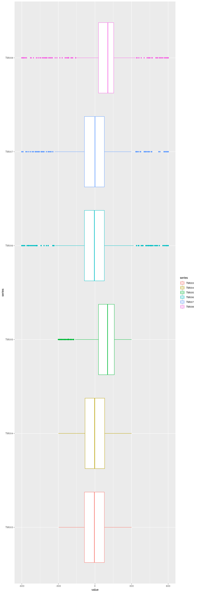

Following the manual, the TM3,4 and 5 are directly related to TM's 6,7 and 8, however I can't discern the difference between them like this. So we might need a correlation plot between these three variables.

Let's use the `ggcorr` functions:

``` r
ggcorr(sat2.num[,..trueNumericalTelemetries])
```

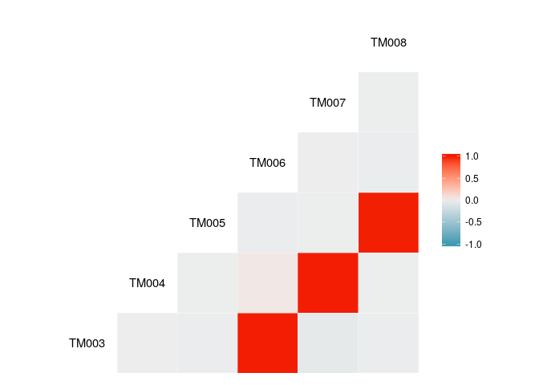 As expected, these telemetries serve the same purpose, so it's no wonder that they're with a solid positive correlation. Let's see which one of these we can use for later analysis.

Battery
-------

Let's take a look on the battery subsystem:

``` r
# TODO: use the converted telemetry table
batteryTelemetries <- c(
  'TM072','TM074','TM075','TM079','TM080','TM081'
)
sat2.melt <- melt.data.table(
  sat2, id.vars = 'date', variable.name = 'series',
  measure.vars = batteryTelemetries
)
ggplot(
  data = sat2.melt,
  aes(x = date, y = value, colour = series)
) +
  geom_line() +
  facet_grid(series ~ .)
```

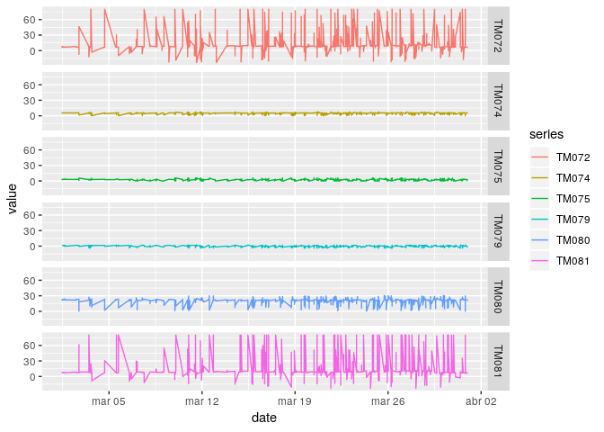

Some noise is generated at the beginning and at the end of the passage...

Let's take a closer look on 81 and 72's data, since that they appear to have a greater variability.

``` r
# TODO: use the converted telemetry table
batteryTempTelemetries <- c('TM072','TM081')
sat2.melt <- melt.data.table(
  sat2, id.vars = 'date', variable.name = 'series',
  measure.vars = batteryTempTelemetries
)
ggplot(
  data = sat2.melt,
  aes(x = date, y = value, colour = series)
) +
  #scale_y_log10() +
  geom_line()
```

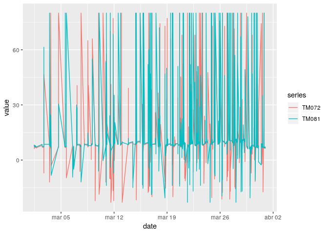

This is simply messy. What's with all the outliers? Impossible to know anything from this graph. Let's try to zoom in...

> Query to know the noise

``` r
firstPassageTime <- sat2[, date][1] %>%
  interval(end = sat2[, date][1336]) # Magic number
int_length(firstPassageTime)
```

    ## [1] 667.498

``` r
sat2.firstPassage <- sat2[1:1336]
```

Just ad-hoc, better algorithm later...!

``` r
sat2.melt <- melt.data.table(
  sat2.firstPassage, id.vars = 'date', variable.name = 'series',
  measure.vars = batteryTempTelemetries
)
ggplot(
  data = sat2.melt,
  aes(x = date, y = value, colour = series)
) +
  geom_line()
```

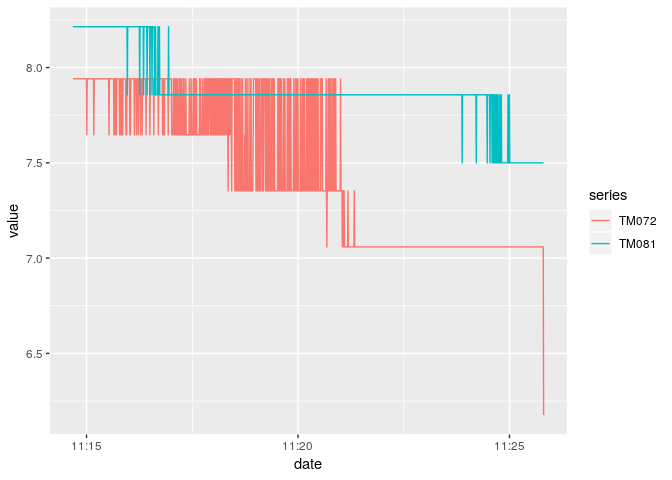

This is ok as an exercise, I guess, but I need to aggregate per passage....

Let's check the correlation:

``` r
sat2[,..batteryTempTelemetries] %>% ggcorr()
```

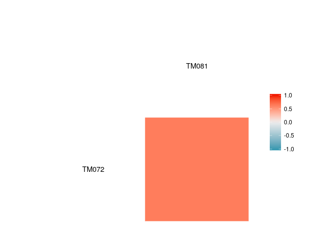 Well, at least this one is as expected.

Extra
-----

What about the "extra" telemetries from before? What do they mean?

``` r
sat2.extra <- sat2[,..extraTelemetries]
summary(sat2.extra)
```

    ##             TM352            TM353            TM354       
    ##  NAO PROCESSADO:296909   Min.   :  3.98   Min.   : 13.72  
    ##                          1st Qu.: 89.37   1st Qu.: 89.49  
    ##                          Median : 90.34   Median : 90.46  
    ##                          Mean   : 90.30   Mean   : 90.36  
    ##                          3rd Qu.: 93.27   3rd Qu.: 93.38  
    ##                          Max.   :176.73   Max.   :177.51  
    ##             TM355       
    ##  NAO PROCESSADO:296909  
    ##                         
    ##                         
    ##                         
    ##                         
    ## 

Looks like 352 and 355 aren't being used in any way... let's focus on 353 and 354, then.

``` r
sat2.extra[, c('TM352','TM355') := NULL]
summary(sat2.extra)
```

    ##      TM353            TM354       
    ##  Min.   :  3.98   Min.   : 13.72  
    ##  1st Qu.: 89.37   1st Qu.: 89.49  
    ##  Median : 90.34   Median : 90.46  
    ##  Mean   : 90.30   Mean   : 90.36  
    ##  3rd Qu.: 93.27   3rd Qu.: 93.38  
    ##  Max.   :176.73   Max.   :177.51

``` r
sat2.melt <- melt.data.table(
  sat2, id.vars = 'date', variable.name = 'series',
  measure.vars = names(sat2.extra)
)
ggplot(
  data = sat2.melt,
  aes(x = date, y = value, colour = series)
) +
  geom_point() +
  scale_x_datetime(date_breaks = "1 day", date_labels = '%d-%m') +
  theme(axis.text.x = element_text(angle = 60, hjust = 1)) +
  facet_grid(series ~ .)
```

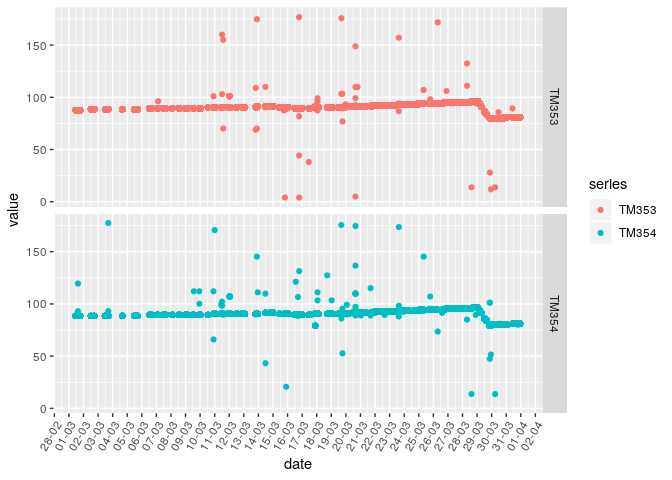

Discrete variables
------------------

Let's try and see the discrete variables this time

``` r
sat2.disc <- sat2[, lapply(sat2, is.factor) == TRUE, with = FALSE]
discreteTelemetries <- names(sat2.disc)
```

``` r
sat2.melt <- melt.data.table(
  sat2, id.vars = 'date', variable.name = 'series',
  measure.vars = discreteTelemetries
)
ggplot(
  data = sat2.melt,
  aes(value, colour = series)
) +
  geom_bar() +
  theme(axis.text.x = element_text(angle = 60, hjust = 1)) +
  facet_wrap(~ series, ncol = 6, scales = 'free')
```

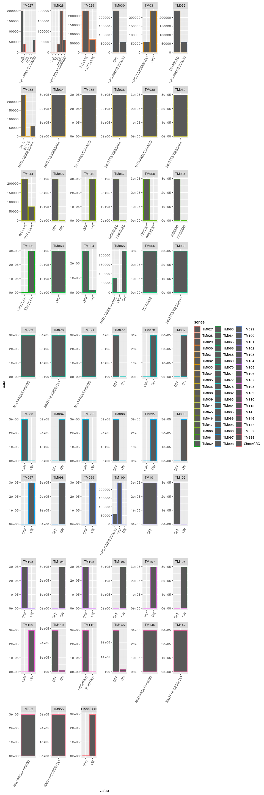

Passages algorithm
------------------

A quick-and-dirty algorithm for adding passages numbers. I am to blame for the 𝒪(*n*)!

*UPDATE:* This is horribly slow, so I saved the results beforehand:

``` r
sat_PASSAGES_FILE = paste0(DATA_DIR, '/sat2_2018-03-passages.fst')
sat2.passages <- read.fst(sat_PASSAGES_FILE, as.data.table = TRUE)
sat2 <- sat2[,passage := sat2.passages$passage]
```

Let's check them!

``` r
sat2.melt <- melt.data.table(
  sat2, id.vars = 'date', variable.name = 'series',
  measure.vars = c('passage')
)
ggplot(
  data = sat2.melt,
  aes(value, colour = series)
) +
  geom_bar() +
  geom_hline(aes(yintercept = mean(value)), color = "blue")
```

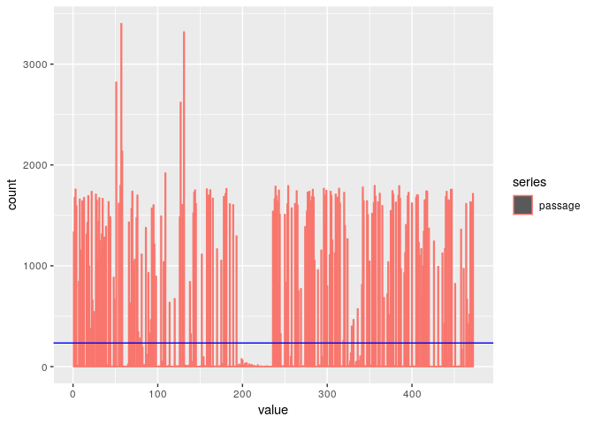

This doesn't tell us much, though. Let's at least try to group by passages.

``` r
sat2.melt <- sat2 %>%
  group_by(passage) %>%
  summarise(duration = (last(date) - first(date)))

ggplot(
  data = sat2.melt,
  aes(duration, colour = passage)
) +
  geom_histogram() +
  geom_vline(aes(xintercept = mean(duration)), col = 'red') +
  geom_vline(aes(xintercept = median(duration)), col = 'blue')
```

    ## Don't know how to automatically pick scale for object of type difftime. Defaulting to continuous.

    ## `stat_bin()` using `bins = 30`. Pick better value with `binwidth`.

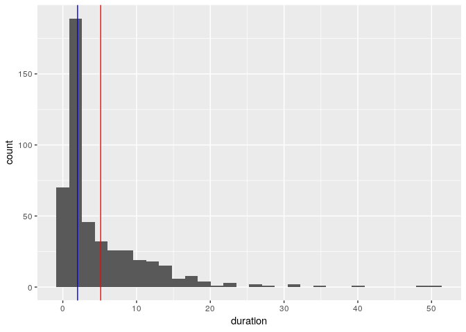

There's.... definitely something wrong with this algorithm.

``` r
above.mean.passages <- sat2.melt %>%
  filter(duration >= median(duration))

above.75th.percentle.passages = sat2.melt %>%
  filter(duration >= 6.000000)

ggplot(
  data = sat2.melt,
  aes(x = passage, y = duration)
) +
  geom_point() +
  geom_quantile()
```

    ## Don't know how to automatically pick scale for object of type difftime. Defaulting to continuous.

    ## Loading required package: SparseM

    ## 
    ## Attaching package: 'SparseM'

    ## The following object is masked from 'package:base':
    ## 
    ##     backsolve

    ## Smoothing formula not specified. Using: y ~ x

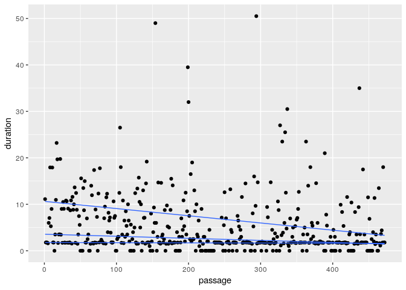

CRC Check
---------

This is a way for the system to know if the current telemetry frame was received properly. It uses a simple bit-adding mechanism to know if the data is as expected, however, it can inform if the data is bad, and not correct it. It's used because it's fast and simple, and missing a telemetry frame or two isn't apparently a big thing. Also, it can happen depending on various telecommunication factors that aren't relevant here.

Let's get a visual for it...

``` r
summary(sat2$CheckCRC)
```

    ##   Erro     OK 
    ##   2051 294858

``` r
#match('CheckCRC', names(sat2))
ggplot(
  data = sat2,
  aes(CheckCRC)
) +
  geom_bar()
```

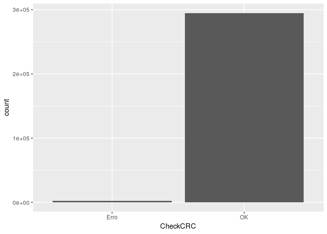

Hmm... this might be the skew in the previous data. Let's make a small check for it.

``` r
sat2.valid <- sat2[CheckCRC != 'Erro']

sat2.melt <- melt.data.table(
  sat2.valid, id.vars = 'date', variable.name = 'series',
  measure.vars = names(sat2.extra)
)
ggplot(
  data = sat2.melt,
  aes(x = date, y = value, colour = series)
) +
  geom_point() +
  scale_x_datetime(date_breaks = "1 day", date_labels = '%d-%m') +
  theme(axis.text.x = element_text(angle = 60, hjust = 1)) +
  facet_grid(series ~ .)
```

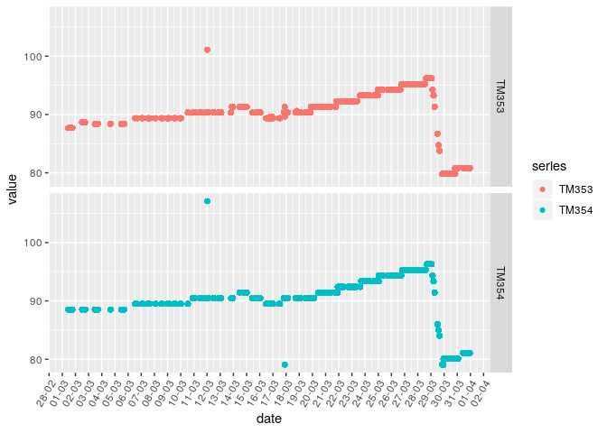

This looks slighly better. Some of the odd values have disappeared, which supports the decision to take out the CRC checks altogether.

I do have one question, though: when are these checks most likely to appear?

``` r
sat2.melt <- melt.data.table(
  sat2, id.vars = 'date', variable.name = 'series',
  measure.vars = c('CheckCRC')
)
ggplot(
  data = sat2.melt,
  aes(x = date, y = value, colour = series)
) +
  geom_jitter() +
  scale_x_datetime(date_breaks = "1 day", date_labels = '%d-%m') +
  theme(axis.text.x = element_text(angle = 60, hjust = 1))
```

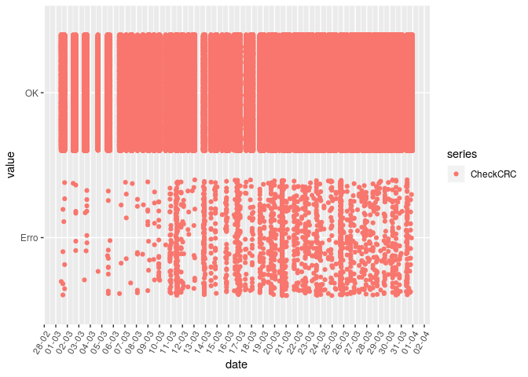 ... question not answered...

Let's group by week to check the distribution.

``` r
sat2.melt <- melt.data.table(
  sat2, id.vars = 'date', variable.name = 'series',
  measure.vars = c('CheckCRC')
)

sat2.weeks <- sat2.melt %>%
  group_by(week = week(date), value) %>%
  summarise(count = n())

ggplot(
  data = sat2.weeks,
  aes(x = week, y = count, fill = value)
) +
  scale_y_log10() +
  geom_col(position = 'dodge')
```

 Since this is log-scale, it just tells us that there's far less errors than OK values, as expected. Without the log, this would get ugly and not so easy to see.
