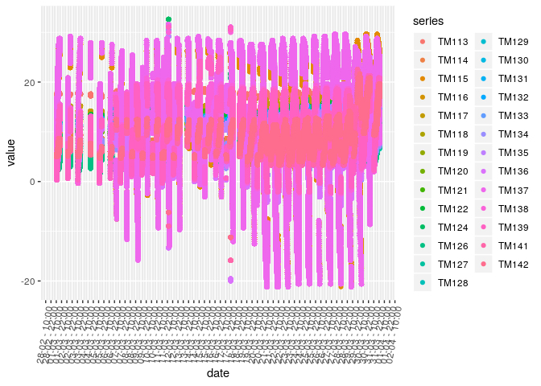
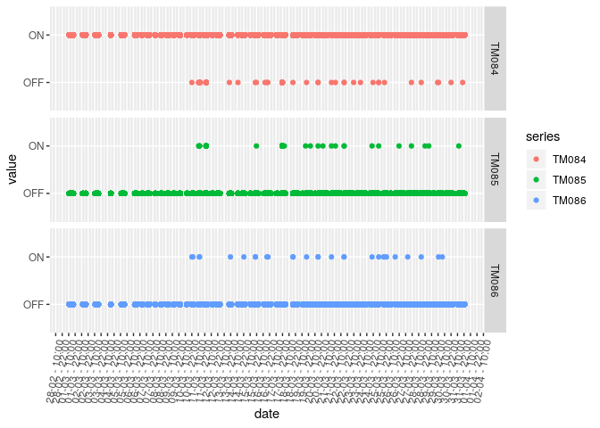
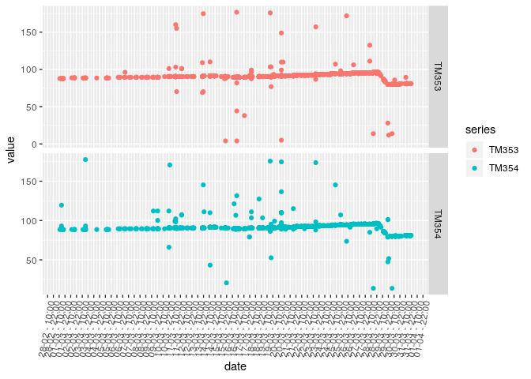

Telemetries General Visualization
================
Yuri Matheus Dias Pereira
17/09/2018

This is part of the EDA, but since it's quite repetitive, I've chosen to use another file for it.

``` r
library(tidyverse) # meta-package: everything else
```

    ## ── Attaching packages ─────────────────────────────────────── tidyverse 1.2.1 ──

    ## ✔ ggplot2 3.0.0     ✔ purrr   0.2.5
    ## ✔ tibble  1.4.2     ✔ dplyr   0.7.6
    ## ✔ tidyr   0.8.1     ✔ stringr 1.3.1
    ## ✔ readr   1.1.1     ✔ forcats 0.3.0

    ## ── Conflicts ────────────────────────────────────────── tidyverse_conflicts() ──
    ## ✖ dplyr::filter() masks stats::filter()
    ## ✖ dplyr::lag()    masks stats::lag()

``` r
library(data.table) # Table
```

    ## 
    ## Attaching package: 'data.table'

    ## The following objects are masked from 'package:dplyr':
    ## 
    ##     between, first, last

    ## The following object is masked from 'package:purrr':
    ## 
    ##     transpose

``` r
library(lubridate) # Date
```

    ## 
    ## Attaching package: 'lubridate'

    ## The following objects are masked from 'package:data.table':
    ## 
    ##     hour, isoweek, mday, minute, month, quarter, second, wday,
    ##     week, yday, year

    ## The following object is masked from 'package:base':
    ## 
    ##     date

``` r
library(GGally) # ggplot2 convenience
```

    ## 
    ## Attaching package: 'GGally'

    ## The following object is masked from 'package:dplyr':
    ## 
    ##     nasa

``` r
library(parallel) # Threads counts
library(fst) # File reading
library(gridExtra) # Plot grids
```

    ## 
    ## Attaching package: 'gridExtra'

    ## The following object is masked from 'package:dplyr':
    ## 
    ##     combine

Reading the Data
================

Let's import the prepared telemetries description table now, along with some useful functions and constants defined in `reading_telemetry.R`:

``` r
PROJ_FOLDER = "../"
source(paste0(PROJ_FOLDER, "R/reading_telemetry.R"))
DATA_DIR = paste0(PROJ_FOLDER, "Data/")
TELEMETRY_FST_PATH = paste0(DATA_DIR, "sat2_2018-03.fst")
sat2_TELEMETRIES_DESC_FILE = paste0(DATA_DIR, "telemetryDescription.csv")

telemetries = read.telemetries.description(sat2_TELEMETRIES_DESC_FILE)
sat2 = read.telemetry.fst(TELEMETRY_FST_PATH)
```

CRC Check
=========

This is a way for the system to know if the current telemetry frame was received properly. It uses a simple bit-adding mechanism to know if the data is as expected, however, it can inform if the data is bad, and not correct it. It's used because it's fast and simple, and missing a telemetry frame or two isn't apparently a big thing. Also, it can happen depending on various telecommunication factors that aren't relevant here.

Let's get a visual for it...

``` r
summary(sat2$CheckCRC)
```

    ##   Erro     OK 
    ##   2051 294858

``` r
#match('CheckCRC', names(sat2))
ggplot(
  data = sat2,
  aes(CheckCRC)
) +
  geom_bar()
```


Hmm... this might be the skew in the previous data. Let's make a small check for it.

``` r
sat2.valid <- sat2[CheckCRC != 'Erro']
telemetries.extra = c('TM353', 'TM354')

sat2.melt <- melt.data.table(
  sat2.valid, id.vars = 'date', variable.name = 'series',
  measure.vars = telemetries.extra
)
ggplot(
  data = sat2.melt,
  aes(x = date, y = value, colour = series)
) +
  geom_point() +
  scale_x_datetime(date_breaks = "1 day", date_labels = '%d-%m') +
  theme(axis.text.x = element_text(angle = 60, hjust = 1)) +
  facet_grid(series ~ .)
```


This looks slighly better. Some of the odd values have disappeared, which supports the decision to take out the CRC checks altogether.

I do have one question, though: when are these checks most likely to appear?

``` r
sat2.melt <- melt.data.table(
  sat2, id.vars = 'date', variable.name = 'series',
  measure.vars = c('CheckCRC')
)
ggplot(
  data = sat2.melt,
  aes(x = date, y = value, colour = series)
) +
  geom_jitter() +
  scale_x_datetime(date_breaks = "1 day", date_labels = '%d-%m') +
  theme(axis.text.x = element_text(angle = 60, hjust = 1))
```

 ... question not answered...

Let's group by week to check the distribution.

``` r
sat2.melt <- melt.data.table(
  sat2, id.vars = 'date', variable.name = 'series',
  measure.vars = c('CheckCRC')
)

sat2.weeks <- sat2.melt %>%
  group_by(week = week(date), value) %>%
  summarise(count = n())

ggplot(
  data = sat2.weeks,
  aes(x = week, y = count, fill = value)
) +
  scale_y_log10() +
  geom_col(position = 'dodge')
```

 Since this is log-scale, it just tells us that there's far less errors than OK values, as expected. Without the log, this would get ugly and not so easy to see.

Testing fot PSS-PCU-Temps
-------------------------

Let's see if there's any sense to the previous data for a single subsystem. I've chosen the battery temps (*72* and *81*) here, because they should be fairly constant, and thus the wrong CRC checks will give us some ideas about the validity of the data.

``` r
sat2.valid <- sat2[CheckCRC != 'Erro']
sat2.invalid <- sat2[CheckCRC == 'Erro']

pss.pcu.temp.telemetries <- c('TM072','TM081')

# Quickly make new TS plots!
simpleTelemTSPlot = function(data,
                             measures,
                             id.vars = 'date',
                             geom = ggplot2::geom_point,
                             scale.date = TRUE,
                             facet = TRUE) {
  # I know, repetition, but uses less memory than the full object
  data.melt = melt.data.table(
    data, id.vars = id.vars, variable.name = 'series',
    measure.vars = measures
  )
  data.plot = ggplot(
    data = data.melt,
    aes(x = date, y = value, colour = series)
  ) +
    geom()
  
  if (scale.date) {
    data.plot = data.plot + 
      scale_x_datetime(
        date_breaks = "12 hours",
        date_labels = '%d-%m - %H:%M'
        ) +
      theme(
        axis.text.x = element_text(
          angle = 80, hjust = 1.0, vjust = 1.0
        )
      )
  }
  if (facet) {
    data.plot = data.plot + 
      facet_grid(series ~ ., scales = 'free_y')
  }

  return(data.plot)
}
```

Sample viewing with all the data

``` r
simpleTelemTSPlot(sat2, pss.pcu.temp.telemetries)
```


Now only the telemetries that failed the CRC check...

``` r
simpleTelemTSPlot(
  sat2.invalid, pss.pcu.temp.telemetries
)
```


And the ones that succeeded it...

``` r
simpleTelemTSPlot(
  sat2.valid, pss.pcu.temp.telemetries
)
```


The trend is quite clear! The noise from before was almost entirely from received data.

Actual explanations
===================

All right, so with a previous part of the EDA, we can do it more formally in this section. I'll start from each of the telemetries, tell what they're supposed to plot and then plot what I can. I'll try to find explanations to weird stuff, and reuse as much code as possible.

I'll follow them in order, and keep the analysis as standardized as possible.

Data Collection System - DCS
----------------------------

``` r
telemetries.dcs = telemetries[SYSTEM == 'DCS']
telemetries.dcs
```

    ##       ID             DESCRIPTION EQP SYSTEM TYPE            RANGE
    ## 1: TM001    Receiver AGC voltage DCP    DCS   AN  -130 to -80 dBm
    ## 2: TM002 RF output power monitor DCP    DCS   AN 17.5 to 20.5 dBm
    ##      ACCURACY WORD BIT               COMMENTS
    ## 1:   +/- 2 dB   48   0                       
    ## 2: +/- 0.2 dB   49   0 Range 17.5-19 (SAT2-A)

This is the actual payload telemetries, these show what the payload antennas are receiving.

### TM001 - Receiver AGC voltage

I believe that this is the voltage for the receiving antena.

Should range from -130 to -80 dBm, but it seems to vary widly.

> The receiver AGC voltage gives an indication of the input level at the receiver input

``` r
curr.telemetries = c('TM001')
summary(sat2[,..curr.telemetries])
```

    ##      TM001       
    ##  Min.   :-130.0  
    ##  1st Qu.:-125.0  
    ##  Median :-121.9  
    ##  Mean   :-121.8  
    ##  3rd Qu.:-118.8  
    ##  Max.   : -80.0

> Plot with all data

``` r
simpleTelemTSPlot(sat2, curr.telemetries)
```


> Plot with only invalid data

``` r
simpleTelemTSPlot(sat2.invalid, curr.telemetries)
```


> Plot with only valid data

``` r
simpleTelemTSPlot(sat2.valid, curr.telemetries)
```

 Now that's more like it! While it does vary, it's way less than what the invalid data makes it look like. A lot of points are on the exact same spot, however.

### Transmitter RF Output Power - TM002

Document gives me nothing. Seems to be the transmitter back to the ground for the data, though.

> Telemetry name Telemetry description Telemetry expected values

``` r
curr.telemetries = c('TM002')
summary(sat2[,..curr.telemetries])
```

    ##      TM002     
    ##  Min.   :13.0  
    ##  1st Qu.:20.5  
    ##  Median :20.5  
    ##  Mean   :20.5  
    ##  3rd Qu.:20.5  
    ##  Max.   :20.5

> Plot with all data

``` r
simpleTelemTSPlot(sat2, curr.telemetries)
```


> Plot with only invalid data

``` r
simpleTelemTSPlot(sat2.invalid, curr.telemetries)
```


> Plot with only valid data

``` r
simpleTelemTSPlot(sat2.valid, curr.telemetries)
```

 Seems nearly constant, so it should be working. These depressions need further investigation, though. Might be either transmission failure or some real artifact in the data.

Attitude Control System - ACS
-----------------------------

``` r
telemetries.acs = telemetries[SYSTEM == 'ACS']
telemetries.acs
```

    ##        ID                 DESCRIPTION EQP SYSTEM TYPE          RANGE
    ##  1: TM003  Y axis output (300 mGauss) MGE    ACS   AN -300 to 300 mG
    ##  2: TM004 -X axis output (300 mGauss) MGE    ACS   AN -300 to 300 mG
    ##  3: TM005  Z axis output (300 mGauss) MGE    ACS   AN -300 to 300 mG
    ##  4: TM006  Y axis output (600 mGauss) MGE    ACS   AN -600 to 600 mG
    ##  5: TM007 -X axis output (600 mGauss) MGE    ACS   AN -600 to 600 mG
    ##  6: TM008  Z axis output (600 mGauss) MGE    ACS   AN -600 to 600 mG
    ##  7: TM009 Angie measurement bit 6 MSB SS1    ACS   BL               
    ##  8: TM010     Angle measurement bit 5 SS1    ACS   BL               
    ##  9: TM011     Angle measurement bit 4 SS1    ACS   BL               
    ## 10: TM012     Angle measurement bit 3 SS1    ACS   BL               
    ## 11: TM013     Angle measurement bit 2 SS1    ACS   BL               
    ## 12: TM014     Angle measurement bit 1 SS1    ACS   BL               
    ## 13: TM015 Angle measurement bit 0 LSB SS1    ACS   BL               
    ## 14: TM016  Detector identification bit SS1    ACS   BL               
    ## 15: TM017       Spin rate measurement SS1    ACS   BL               
    ## 16: TM018 Angle measurement bit 6 MSB SS2    ACS   BL               
    ## 17: TM019     Angle measurement bit 5 SS2    ACS   BL               
    ## 18: TM020     Angle measurement bit 4 SS2    ACS   BL               
    ## 19: TM021     Angle measurement bit 3 SS2    ACS   BL               
    ## 20: TM022     Angie measurement bit 2 SS2    ACS   BL               
    ## 21: TM023     Angle measurement bit 1 SS2    ACS   BL               
    ## 22: TM024 Angle measurement bit 0 LSB SS2    ACS   BL               
    ## 23: TM025  Detector identification bit SS2    ACS   BL               
    ## 24: TM026       Spin rate measurement SS2    ACS   BL               
    ##        ID                 DESCRIPTION EQP SYSTEM TYPE          RANGE
    ##     ACCURACY WORD BIT COMMENTS
    ##  1: +/- 2 mG   50   0         
    ##  2: +/- 2 mG   51   0         
    ##  3: +/- 2 mG   52   0         
    ##  4: +/- 5 mG   53   0         
    ##  5: +/- 5 mG   54   0         
    ##  6: +/- 5 mG   55   0         
    ##  7:             4   1         
    ##  8:             4   2         
    ##  9:             4   3         
    ## 10:             4   4         
    ## 11:             4   5         
    ## 12:             4   6         
    ## 13:             4   7         
    ## 14:             4   O         
    ## 15:             6   0         
    ## 16:             5   1         
    ## 17:             5   2         
    ## 18:             5   3         
    ## 19:             5   4         
    ## 20:             5   5         
    ## 21:             5   6         
    ## 22:             5   7         
    ## 23:             5   0         
    ## 24:             6   1         
    ##     ACCURACY WORD BIT COMMENTS

For this we have a good number of telemetries, separated into subsystems. Let's do some in bulk.

### MGE axis output (300 mGauss) - TM003, TM004, TM005

These are apparently the magnetometer readings for all three axis. Documentation gives me nothing if the 300 mGauss one is the same as the 600 mGauss or if they are different instruments.

These should all vary between -300 and 300 mGauss, with a +/- 2 mGauss error.

``` r
curr.telemetries = c('TM003', 'TM004', 'TM005')
summary(sat2[,..curr.telemetries])
```

    ##      TM003              TM004               TM005        
    ##  Min.   :-297.600   Min.   :-300.0000   Min.   :-300.00  
    ##  1st Qu.: -86.400   1st Qu.: -81.6000   1st Qu.:  28.80  
    ##  Median :  -4.800   Median :  -2.4000   Median : 103.20  
    ##  Mean   :  -4.372   Mean   :  -0.8808   Mean   :  92.67  
    ##  3rd Qu.:  76.800   3rd Qu.:  79.2000   3rd Qu.: 158.40  
    ##  Max.   : 300.000   Max.   : 300.0000   Max.   : 300.00

> Plot with all data

``` r
simpleTelemTSPlot(sat2, curr.telemetries)
```


> Plot with only invalid data

``` r
simpleTelemTSPlot(sat2.invalid, curr.telemetries)
```


> Plot with only valid data

``` r
simpleTelemTSPlot(sat2.valid, curr.telemetries)
```


While the invalid data certainly had all that spread, this requires further looking to analyze whether it's worth mentioning. The values do vary widly even with that, though.

### MGE axis output (600 mGauss) - TM006, TM007, TM008

Seems to be the same measurement as the last three, but either with a different equipment or with different means of measure, documentation isn't clear at all.

Range from -600 to 600 mGauss.

``` r
curr.telemetries = c('TM006', 'TM007', 'TM008')
summary(sat2[,..curr.telemetries])
```

    ##      TM006             TM007              TM008        
    ##  Min.   :-600.00   Min.   :-600.000   Min.   :-600.00  
    ##  1st Qu.: -86.40   1st Qu.: -86.400   1st Qu.:  28.80  
    ##  Median :  -4.80   Median :   0.000   Median : 105.60  
    ##  Mean   :  -5.24   Mean   :  -1.313   Mean   :  92.46  
    ##  3rd Qu.:  76.80   3rd Qu.:  76.800   3rd Qu.: 153.60  
    ##  Max.   : 600.00   Max.   : 600.000   Max.   : 600.00

> Plot with all data

``` r
simpleTelemTSPlot(sat2, curr.telemetries)
```


> Plot with only invalid data

``` r
simpleTelemTSPlot(sat2.invalid, curr.telemetries)
```


> Plot with only valid data

``` r
simpleTelemTSPlot(sat2.valid, curr.telemetries)
```


Hmmm, the valid data is surprisingly coherent with the 300 mGauss one. What's the point of this more sensible magnetometer, then?

### Solar Sensor (SS) - 1 - TM009~TM017

These are the bits that identify the solar sensor measurements? This probably has a calculation for each bit, so it doesn't make sense to check the value for each day.

``` r
curr.telemetries = telemetries.acs[EQP == 'SS1']$ID
summary(sat2[, ..curr.telemetries])
```

    ##      TM009            TM010               TM011       TM012       
    ##  Min.   :0.0000   Min.   :0.0000000   Min.   :0   Min.   :0.0000  
    ##  1st Qu.:1.0000   1st Qu.:0.0000000   1st Qu.:1   1st Qu.:0.0000  
    ##  Median :1.0000   Median :0.0000000   Median :1   Median :1.0000  
    ##  Mean   :0.9999   Mean   :0.0001145   Mean   :1   Mean   :0.5851  
    ##  3rd Qu.:1.0000   3rd Qu.:0.0000000   3rd Qu.:1   3rd Qu.:1.0000  
    ##  Max.   :1.0000   Max.   :1.0000000   Max.   :1   Max.   :1.0000  
    ##      TM013            TM014            TM015            TM016       
    ##  Min.   :0.0000   Min.   :0.0000   Min.   :0.0000   Min.   :0.0000  
    ##  1st Qu.:1.0000   1st Qu.:0.0000   1st Qu.:0.0000   1st Qu.:1.0000  
    ##  Median :1.0000   Median :0.0000   Median :1.0000   Median :1.0000  
    ##  Mean   :0.8468   Mean   :0.4807   Mean   :0.5398   Mean   :0.8298  
    ##  3rd Qu.:1.0000   3rd Qu.:1.0000   3rd Qu.:1.0000   3rd Qu.:1.0000  
    ##  Max.   :1.0000   Max.   :1.0000   Max.   :1.0000   Max.   :1.0000  
    ##      TM017       
    ##  Min.   :0.0000  
    ##  1st Qu.:0.0000  
    ##  Median :1.0000  
    ##  Mean   :0.5036  
    ##  3rd Qu.:1.0000  
    ##  Max.   :1.0000

> Plot with all data

``` r
simpleTelemTSPlot(sat2, curr.telemetries)
```


> Plot with only invalid data

``` r
simpleTelemTSPlot(sat2.invalid, curr.telemetries)
```


> Plot with only valid data

``` r
simpleTelemTSPlot(sat2.valid, curr.telemetries)
```


As expected, there isn't much to be learned here. This appears to be highly specific, since these are bits, and should need a proper algorithm/translation to know the difference and how to read it. How does SATCS does it, though? I highly doubt that operators can (or better yet, *should*) untangle this by themselves...?

### Solar Sensor (SS) - 2 - TM018~TM026

The second solar sensor measurements? No idea if these are two different sensors or just part of the first one. Probably two different sensors.

``` r
curr.telemetries = telemetries.acs[EQP == 'SS2']$ID
summary(sat2[, ..curr.telemetries])
```

    ##      TM018       TM019              TM020            TM021       
    ##  Min.   :0   Min.   :0.000000   Min.   :0.0000   Min.   :0.0000  
    ##  1st Qu.:1   1st Qu.:0.000000   1st Qu.:1.0000   1st Qu.:0.0000  
    ##  Median :1   Median :0.000000   Median :1.0000   Median :1.0000  
    ##  Mean   :1   Mean   :0.009862   Mean   :0.9999   Mean   :0.5892  
    ##  3rd Qu.:1   3rd Qu.:0.000000   3rd Qu.:1.0000   3rd Qu.:1.0000  
    ##  Max.   :1   Max.   :1.000000   Max.   :1.0000   Max.   :1.0000  
    ##      TM022            TM023            TM024            TM025       
    ##  Min.   :0.0000   Min.   :0.0000   Min.   :0.0000   Min.   :0.0000  
    ##  1st Qu.:1.0000   1st Qu.:0.0000   1st Qu.:0.0000   1st Qu.:1.0000  
    ##  Median :1.0000   Median :1.0000   Median :1.0000   Median :1.0000  
    ##  Mean   :0.8128   Mean   :0.5409   Mean   :0.5204   Mean   :0.8669  
    ##  3rd Qu.:1.0000   3rd Qu.:1.0000   3rd Qu.:1.0000   3rd Qu.:1.0000  
    ##  Max.   :1.0000   Max.   :1.0000   Max.   :1.0000   Max.   :1.0000  
    ##      TM026       
    ##  Min.   :0.0000  
    ##  1st Qu.:0.0000  
    ##  Median :0.0000  
    ##  Mean   :0.4658  
    ##  3rd Qu.:1.0000  
    ##  Max.   :1.0000

> Plot with all data

``` r
simpleTelemTSPlot(sat2, curr.telemetries)
```


> Plot with only invalid data

``` r
simpleTelemTSPlot(sat2.invalid, curr.telemetries)
```


> Plot with only valid data

``` r
simpleTelemTSPlot(sat2.valid, curr.telemetries)
```


As expected, this is not a good visualization, albeit the values are somewhat similar than the SS1 ones. Not sure what can be learned from this data, need further investigation.

Telemetry and Telecommands Subsystem - TMTC
-------------------------------------------

This one is quite big. There's three main equipments: TR1, TR2, which are the TM transmission antennas/channels and DEC, presumably that which decodificates the TM messages.

``` r
telemetries.tmtc = telemetries[SYSTEM == 'TMTC']
telemetries.tmtc
```

    ##        ID                    DESCRIPTION EQP SYSTEM TYPE           RANGE
    ##  1: TM027           Receiver AGC voltage TR1   TMTC   AN  -130 to -50 dB
    ##  2: TM028       Static phase error (SPE) TR1   TMTC   AN -130 to 130 kHz
    ##  3: TM029                    Lock status TR1   TMTC   BL                
    ##  4: TM030         TM video input channel TR1   TMTC   BL                
    ##  5: TM031          Ranging on/off status TR1   TMTC   BL                
    ##  6: TM032 Coherent enable/disable status TR1   TMTC   BL                
    ##  7: TM033        RF output power monitor TR1   TMTC   AN    27 to 30 dBm
    ##  8: TM042           Receiver AGC voltage TR2   TMTC   AN -130 to -50 dBm
    ##  9: TM043       Static phase error (SPE) TR2   TMTC   AN -130 to 130 kHz
    ## 10: TM044                    Lock status TR2   TMTC   BL                
    ## 11: TM045          TM video input signal TR2   TMTC   BL                
    ## 12: TM046          Ranging on/off status TR2   TMTC   BL                
    ## 13: TM047 Coherent enable/disable status TR2   TMTC   BL                
    ## 14: TM048        RF output power monitor TR2   TMTC   AN    25 to 28 dBm
    ## 15: TM058  ASW & frame st., mode. word A DEC   TMTC   DS                
    ## 16: TM059             Data words B and C DEC   TMTC   DS                
    ## 17: TM060          Subcarrier presence 1 DEC   TMTC   BL                
    ## 18: TM061          Subcarrier presence 2 DEC   TMTC   BL                
    ##       ACCURACY WORD BIT                COMMENTS
    ##  1:   +/- 2 dB   56   0 -130 to -70 dBm(SAT2-A)
    ##  2:  +/- 1 kHz   57   0                        
    ##  3:               7   O 1=in-lock 0=out-of-lock
    ##  4:               7   1             1=ch1 0=ch2
    ##  5:               7   2              1=on 0=off
    ##  6:               7   3      1=enable 0=disable
    ##  7: +/- 0.2 dB   58   0   Range: 27-30 (SAT2-A)
    ##  8:   +/- 2 dB   60   0                        
    ##  9:  +/- 1 kHz   61   0                        
    ## 10:               7   4 1=in-lock 0=out-of-lock
    ## 11:               7   5             1=ch1 0=ch2
    ## 12:               7   6              1=on 0=off
    ## 13:               7   7      1=enable 0=disable
    ## 14: +/- 0.2 dB   62   0    Range 25-31 (SAT2-A)
    ## 15:               0   0           routed to OBC
    ## 16:               0   0                not used
    ## 17:               6   2      1=present 0=absent
    ## 18:               6   3      1=present 0=absent

Transmitter/Channel 1 - TR1
---------------------------

``` r
telemetries.tmtc.tr1 = telemetries.tmtc[EQP == 'TR1']
telemetries.tmtc.tr1
```

    ##       ID                    DESCRIPTION EQP SYSTEM TYPE           RANGE
    ## 1: TM027           Receiver AGC voltage TR1   TMTC   AN  -130 to -50 dB
    ## 2: TM028       Static phase error (SPE) TR1   TMTC   AN -130 to 130 kHz
    ## 3: TM029                    Lock status TR1   TMTC   BL                
    ## 4: TM030         TM video input channel TR1   TMTC   BL                
    ## 5: TM031          Ranging on/off status TR1   TMTC   BL                
    ## 6: TM032 Coherent enable/disable status TR1   TMTC   BL                
    ## 7: TM033        RF output power monitor TR1   TMTC   AN    27 to 30 dBm
    ##      ACCURACY WORD BIT                COMMENTS
    ## 1:   +/- 2 dB   56   0 -130 to -70 dBm(SAT2-A)
    ## 2:  +/- 1 kHz   57   0                        
    ## 3:               7   O 1=in-lock 0=out-of-lock
    ## 4:               7   1             1=ch1 0=ch2
    ## 5:               7   2              1=on 0=off
    ## 6:               7   3      1=enable 0=disable
    ## 7: +/- 0.2 dB   58   0   Range: 27-30 (SAT2-A)

These should be the telemetries for the first telemetry transmission channel/antenna. I know that these are in C band, as the payload antennas are separate from the TM ones.

We have Analog and Digital channel telemetries, the digital ones work as boolean values, and the analog ones as floating points.

Let us see the analog ones first.

``` r
curr.telemetries = telemetries.tmtc.tr1[TYPE == 'AN']$ID
summary(sat2[,..curr.telemetries])
```

    ##             TM027                   TM028                   TM033       
    ##  -105          :199001   -140          :     1   24.72         :237966  
    ##  -107          : 38944   10            :    71   24.725        :    54  
    ##  -109          :     1   30            : 38945   NAO PROCESSADO: 58889  
    ##  -125          :     1   36.667        :199002                          
    ##  -140          :    72   NAO PROCESSADO: 58890                          
    ##  NAO PROCESSADO: 58890

THat is ineed a hell lot of noise. Let's see if we can plot this...

> Plot with all data

``` r
simpleTelemTSPlot(sat2, curr.telemetries)
```


> Plot with only invalid data

``` r
simpleTelemTSPlot(sat2.invalid, curr.telemetries)
```


> Plot with only valid data

``` r
simpleTelemTSPlot(sat2.valid, curr.telemetries)
```


To help make sense of these plots, we'll need the other side of the data: the Digital values. The "Not processed" values in the previous plots were due to TM029: it tells us if this particular equipment is being used for transmission or not. Sometimes it is, sometimes it isn't, that's why it only works if it's necessary. And why the CRC failures and the valid data are so close to one another.

TM's 29 to 32 are the ones responsible for letting us know if the subsystem is being used or not, so they're useful for the other telemetries.

``` r
curr.telemetries = telemetries.tmtc.tr1[TYPE == 'BL']$ID
summary(sat2[,..curr.telemetries])
```

    ##       TM029                   TM030                   TM031       
    ##  IN LOCK :227271   CH2           :238020   NAO PROCESSADO: 58890  
    ##  OUT LOCK: 69638   NAO PROCESSADO: 58889   OFF           :238019  
    ##             TM032       
    ##  DISABLED      :238020  
    ##  NAO PROCESSADO: 58889

> Plot with all data

``` r
simpleTelemTSPlot(sat2, curr.telemetries)
```


> Plot with only invalid data

``` r
simpleTelemTSPlot(sat2.invalid, curr.telemetries)
```


> Plot with only valid data

``` r
simpleTelemTSPlot(sat2.valid, curr.telemetries)
```


Interestingly, 31 is ranging status with this transmitter. Doesn't appear to have been used, though.

Transmitter/Channel 2 - TR2
---------------------------

The same thing as TR1, mostly for redundancy I believe.

``` r
telemetries.tmtc.tr2 = telemetries.tmtc[EQP == 'TR2']
telemetries.tmtc.tr2
```

    ##       ID                    DESCRIPTION EQP SYSTEM TYPE           RANGE
    ## 1: TM042           Receiver AGC voltage TR2   TMTC   AN -130 to -50 dBm
    ## 2: TM043       Static phase error (SPE) TR2   TMTC   AN -130 to 130 kHz
    ## 3: TM044                    Lock status TR2   TMTC   BL                
    ## 4: TM045          TM video input signal TR2   TMTC   BL                
    ## 5: TM046          Ranging on/off status TR2   TMTC   BL                
    ## 6: TM047 Coherent enable/disable status TR2   TMTC   BL                
    ## 7: TM048        RF output power monitor TR2   TMTC   AN    25 to 28 dBm
    ##      ACCURACY WORD BIT                COMMENTS
    ## 1:   +/- 2 dB   60   0                        
    ## 2:  +/- 1 kHz   61   0                        
    ## 3:               7   4 1=in-lock 0=out-of-lock
    ## 4:               7   5             1=ch1 0=ch2
    ## 5:               7   6              1=on 0=off
    ## 6:               7   7      1=enable 0=disable
    ## 7: +/- 0.2 dB   62   0    Range 25-31 (SAT2-A)

Won't repeat: same explanation as TR1.

``` r
curr.telemetries = telemetries.tmtc.tr2[TYPE == 'AN']$ID
summary(sat2[,..curr.telemetries])
```

    ##      TM042             TM043              TM048      
    ##  Min.   :-140.00   Min.   :-160.000   Min.   :25.00  
    ##  1st Qu.:-137.92   1st Qu.: -20.000   1st Qu.:27.44  
    ##  Median : -75.00   Median :   5.000   Median :27.44  
    ##  Mean   : -87.95   Mean   :   1.278   Mean   :27.45  
    ##  3rd Qu.: -66.25   3rd Qu.:  18.333   3rd Qu.:27.44  
    ##  Max.   : -50.00   Max.   : 160.000   Max.   :31.00

...Though this one is definitely the one that is mostly used.

> Plot with all data

``` r
simpleTelemTSPlot(sat2, curr.telemetries)
```


> Plot with only invalid data

``` r
simpleTelemTSPlot(sat2.invalid, curr.telemetries)
```


> Plot with only valid data

``` r
simpleTelemTSPlot(sat2.valid, curr.telemetries)
```


48 is nearly constant, but it's still not shielded from noise. 42 and 43 are widly different and vary a lot, which would make sense from their constant use... However, can't explain these values properly.

Now the digital values. Again, the same as TR1, but this is the most used equipment.

``` r
curr.telemetries = telemetries.tmtc.tr2[TYPE == 'BL']$ID
summary(sat2[,..curr.telemetries])
```

    ##       TM044        TM045        TM046             TM047       
    ##  IN LOCK :222508   CH1:296889   OFF:    91   DISABLED:296886  
    ##  OUT LOCK: 74401   CH2:    20   ON :296818   ENABLED :    23

> Plot with all data

``` r
simpleTelemTSPlot(sat2, curr.telemetries)
```


> Plot with only invalid data

``` r
simpleTelemTSPlot(sat2.invalid, curr.telemetries)
```


> Plot with only valid data

``` r
simpleTelemTSPlot(sat2.valid, curr.telemetries)
```

 An interesting result from the CRC check! It's always using CH1, always ON and always with coherent disabled, while the CRC data bring an entirely different visualization of it.

### Decodificator - DEC

``` r
telemetries.tmtc.dec = telemetries.tmtc[EQP == 'DEC']
telemetries.tmtc.dec
```

    ##       ID                   DESCRIPTION EQP SYSTEM TYPE RANGE ACCURACY WORD
    ## 1: TM058 ASW & frame st., mode. word A DEC   TMTC   DS                   0
    ## 2: TM059            Data words B and C DEC   TMTC   DS                   0
    ## 3: TM060         Subcarrier presence 1 DEC   TMTC   BL                   6
    ## 4: TM061         Subcarrier presence 2 DEC   TMTC   BL                   6
    ##    BIT           COMMENTS
    ## 1:   0      routed to OBC
    ## 2:   0           not used
    ## 3:   2 1=present 0=absent
    ## 4:   3 1=present 0=absent

Not exactly sure what this does, but it's an equipment too. Let's see if it's even being used.

While on the documentation, TMs 58 and 59 do not exist on this data. So let's go with only the digital values, TMs 60 and 61.

``` r
curr.telemetries = telemetries.tmtc.dec[TYPE == 'BL']$ID
summary(sat2[,..curr.telemetries])
```

    ##      TM060            TM061       
    ##  ABSENT :294669   ABSENT :294775  
    ##  PRESENT:  2240   PRESENT:  2134

> Plot with all data

``` r
simpleTelemTSPlot(sat2, curr.telemetries)
```


> Plot with only invalid data

``` r
simpleTelemTSPlot(sat2.invalid, curr.telemetries)
```


> Plot with only valid data

``` r
simpleTelemTSPlot(sat2.valid, curr.telemetries)
```


Well, these subcarriers aren't common, at least. They only appear at times, but not sure how accurate this is. This is mostly not useful for this analysis.

Reaction Wheel Experiment - ERR
-------------------------------

This was apparently just an experiment at a reaction wheel, however not sure if it works or is being used nowadays...

``` r
telemetries.err = telemetries[SYSTEM == 'ERR']
telemetries.err
```

    ##       ID           DESCRIPTION EQP SYSTEM TYPE         RANGE ACCURACY WORD
    ## 1: TM034           Motor speed ERR    ERR   AN -1500 to 1500            88
    ## 2: TM035         Motor current ERR    ERR   AN    0 - 250 mA            89
    ## 3: TM036     Motor temperature ERR    ERR   TH     5 to 35 C            90
    ## 4: TM038 Bearing temperature 1 ERR    ERR   TH      510 35 C            92
    ## 5: TM039 Bearing temperature 2 ERR    ERR   TH     5 to 35 C            93
    ## 6: TM063            ERR status ERR    ERR   BL                           9
    ## 7: TM146 Speed profile status 1 ERR    ERR   BL                           6
    ## 8: TM147 Speed profile status 2 ERR    ERR   BL                           6
    ##    BIT                COMMENTS
    ## 1:   0                   (rpm)
    ## 2:   0                        
    ## 3:   0                        
    ## 4:   0                        
    ## 5:   0                        
    ## 6:   2              1=on 0=off
    ## 7:   6 00=100rpm;01=750rpm(**)
    ## 8:   7   10=1500rpm; 11=500rpm

``` r
curr.telemetries = telemetries.err$ID
summary(sat2[,..curr.telemetries])
```

    ##             TM034                   TM035                   TM036       
    ##  NAO PROCESSADO:296909   NAO PROCESSADO:296909   NAO PROCESSADO:296909  
    ##             TM038                   TM039        TM063       
    ##  NAO PROCESSADO:296909   NAO PROCESSADO:296909   OFF:296909  
    ##             TM146                   TM147       
    ##  NAO PROCESSADO:296909   NAO PROCESSADO:296909

Won't even bother plotting: this apparently doesn't work or never did. At least not for this part of the data.

TM 63 shows us that it's on the `OFF` position though, so maybe it can be turned on if necessary...?

Solar Cell Experiment - SCE
---------------------------

Solar cell! But what part of it is an experiment?

``` r
telemetries.sce = telemetries[SYSTEM == 'SCE']
telemetries.sce
```

    ##       ID                    DESCRIPTION EQP SYSTEM TYPE        RANGE
    ## 1: TM051 SCE Telemetry Current lsc(Vsh) SCE    SCE   AN 10 to 150 mA
    ## 2: TM052 SCE Telemetry Voltage UL (Vmp) SCE    SCE   AN 0.1 to 1.2 V
    ## 3: TM053 SCE Telemetry Voltage Uoc(Voc) SCE    SCE   AN 0.1 to 1.5 V
    ##      ACCURACY WORD BIT COMMENTS
    ## 1: +/- 0.01 V   83   0         
    ## 2:              84   0         
    ## 3:              85   0

Current and voltage, just that.

``` r
curr.telemetries = telemetries.sce$ID
summary(sat2[,..curr.telemetries])
```

    ##      TM051             TM052             TM053       
    ##  Min.   :  0.000   Min.   :0.00000   Min.   :0.0000  
    ##  1st Qu.:  0.000   1st Qu.:0.00000   1st Qu.:0.0000  
    ##  Median :  1.875   Median :0.03125   Median :0.5400  
    ##  Mean   : 23.439   Mean   :0.21655   Mean   :0.4975  
    ##  3rd Qu.: 35.833   3rd Qu.:0.33750   3rd Qu.:1.0000  
    ##  Max.   :150.000   Max.   :1.20000   Max.   :1.5000

> Plot with all data

``` r
simpleTelemTSPlot(sat2, curr.telemetries)
```


> Plot with only invalid data

``` r
simpleTelemTSPlot(sat2.invalid, curr.telemetries)
```


> Plot with only valid data

``` r
simpleTelemTSPlot(sat2.valid, curr.telemetries)
```


This is....simply chaotic, even with only the valid data. No idea how to read this, there should be charts on the documentation though.

On Board Supervisor - OBS
-------------------------

Basically the OBC/OBDH.

``` r
telemetries.obs = telemetries[SYSTEM == 'OBS']
telemetries.obs
```

    ##       ID                  DESCRIPTION EQP SYSTEM TYPE        RANGE
    ## 1: TM068 MP current regulator voltage OBC    OBS   AN 1.3 to 2.4 V
    ## 2: TM069       Microprocessor voltage OBC    OBS   AN 0.6 to 1.3 V
    ## 3: TM070   Microprocessor temperature OBC    OBS   TH    4 to 34 C
    ## 4: TM071                 Failure flag OBC    OBS   BL             
    ##      ACCURACY WORD BIT        COMMENTS
    ## 1: +/- 0.01 V   67   0                
    ## 2: +/- 0.01 V   68   0                
    ## 3:    +/- 1 C   17   0                
    ## 4:               6   5 1=failed O=good

``` r
curr.telemetries = telemetries.obs$ID
summary(sat2[,..curr.telemetries])
```

    ##             TM068                   TM069                   TM070       
    ##  NAO PROCESSADO:296909   NAO PROCESSADO:296909   NAO PROCESSADO:296909  
    ##             TM071       
    ##  NAO PROCESSADO:296909

Which we can safely ignore them for now.

Temperatures - INT
------------------

These are all the temperature readings on the satellite. These measure all of the subsystems, so it's a good general view of the satellite life.

``` r
telemetries.int = telemetries[EQP == 'INT']
telemetries.int
```

    ##        ID                    DESCRIPTION EQP SYSTEM TYPE       RANGE
    ##  1: TM113        DCP temperature monitor INT          TH   6 to 25 C
    ##  2: TM114        MGE temperature monitor INT          TH  -4 to 29 C
    ##  3: TM115        LP6 temperature monitor INT          TH -34 to 36 C
    ##  4: TM116        TR1 temperature monitor INT          TH   7 to 27 C
    ##  5: TM117        TR2 temperature monitor INT          TH   8 to 26 C
    ##  6: TM118        DEC temperature monitor INT          TH   6 to 24 C
    ##  7: TM119        OBC temperature monitor INT          TH   5 to 27 C
    ##  8: TM120        ERR temperature monitor INT          TH   5 to 28 C
    ##  9: TM121        ENC temperature monitor INT          TH   6 to 25 C
    ## 10: TM122        PCU temperature monitor INT          TH   4 to 29 C
    ## 11: TM124        SD1 temperature monitor INT          TH  -4 to 41 C
    ## 12: TM126        SD2 temperature monitor INT          TH  -3 to 42 C
    ## 13: TM127        BAT temperature monitor INT          TH  -2 to 20 C
    ## 14: TM128        DCC temperature monitor INT          TH   7 to 27 C
    ## 15: TM129        RDU temperature monitor INT          TH   5 to 24 C
    ## 16: TM130        SS1 temperature monitor INT          TH   5 to 26 C
    ## 17: TM131        SS2 temperature monitor INT          TH   5 to 26 C
    ## 18: TM132    CP inf. temperature monitor INT          TH  -1 to 27 C
    ## 19: TM133    CP sup. temperature monitor INT          TH  -1 to 27 C
    ## 20: TM134  BP temper. monitor (near BAT) INT          TH -17 to 30 C
    ## 21: TM135  BP temper. monitor (near PCU) INT          TH -17 to 30 C
    ## 22: TM136         TP temperature monitor INT          TH -12 to 24 C
    ## 23: TM137        LP2 temperature monitor INT          TH -34 to 36 C
    ## 24: TM138 +X spin TC temperature monitor INT          TH -25 to 36 C
    ## 25: TM139 -Y spin TC temperature monitor INT          TH -25 to 36 C
    ## 26: TM141   Axis TQC temperature monitor INT          TH  -1 to 22 C
    ## 27: TM142        NDP temperature monitor INT          TH  -3 to 21 C
    ##        ID                    DESCRIPTION EQP SYSTEM TYPE       RANGE
    ##     ACCURACY WORD BIT    COMMENTS
    ##  1:  +/- 1 C   18   0 outside box
    ##  2:  +/- 1 C   20   0 outside box
    ##  3:  +/- 1 C   22   0            
    ##  4:  +/- 1 C   24   0 outside box
    ##  5:  +/- 1 C   26   0 outside box
    ##  6:  +/- 1 C   28   0 outside box
    ##  7:  +/- 1 C   30   0 outside box
    ##  8:  +/- 1 C   32   0 outside box
    ##  9:  +/- 1 C   34   0 outside box
    ## 10:  +/- 1 C   36   0 outside box
    ## 11:  +/- 1 C   40   0 outside box
    ## 12:  +/- 1 C   44   0 outside box
    ## 13:  +/- 1 C   46   0 outside box
    ## 14:  +/- 1 C   19   0 outside box
    ## 15:  +/- 1 C   21   0 outside box
    ## 16:  +/- 1 C   23   0 outside box
    ## 17:  +/- 1 C   25   0 outside box
    ## 18:  +/- 1 C   27   0            
    ## 19:  +/- 1 C   29   0            
    ## 20:  +/- 1 C   31   0            
    ## 21:  +/- 1 C   33   0            
    ## 22:  +/- 1 C   35   0            
    ## 23:  +/- 1 C   37   0            
    ## 24:  +/- 1 C   39   0            
    ## 25:  +/- 1 C   41   0            
    ## 26:  +/- 1 C   45   0 outside box
    ## 27:  +/- 1 C   47   0 outside box
    ##     ACCURACY WORD BIT    COMMENTS

They are all from thermistor channels.

I'll attempt to plot all of them together, but not sure... Let's see!

``` r
curr.telemetries = telemetries.int$ID
summary(sat2[,..curr.telemetries])
```

    ##      TM113            TM114             TM115            TM116       
    ##  Min.   :-60.00   Min.   :-60.000   Min.   :-60.00   Min.   :-60.00  
    ##  1st Qu.: 17.59   1st Qu.:  8.667   1st Qu.:  4.00   1st Qu.: 12.76  
    ##  Median : 17.93   Median : 11.379   Median : 20.42   Median : 13.79  
    ##  Mean   : 17.83   Mean   : 10.855   Mean   : 13.86   Mean   : 13.67  
    ##  3rd Qu.: 18.28   3rd Qu.: 12.414   3rd Qu.: 25.42   3rd Qu.: 14.14  
    ##  Max.   : 80.00   Max.   : 80.000   Max.   : 80.00   Max.   : 80.00  
    ##      TM117            TM118            TM119            TM120       
    ##  Min.   :-60.00   Min.   :-60.00   Min.   :-60.00   Min.   :-60.00  
    ##  1st Qu.: 14.14   1st Qu.: 11.38   1st Qu.: 11.03   1st Qu.: 10.35  
    ##  Median : 15.86   Median : 12.76   Median : 11.38   Median : 11.03  
    ##  Mean   : 15.48   Mean   : 12.75   Mean   : 11.62   Mean   : 11.10  
    ##  3rd Qu.: 16.55   3rd Qu.: 13.79   3rd Qu.: 12.41   3rd Qu.: 11.38  
    ##  Max.   : 80.00   Max.   : 80.00   Max.   : 80.00   Max.   : 80.00  
    ##      TM121            TM122            TM124            TM126       
    ##  Min.   :-60.00   Min.   :-60.00   Min.   :-60.00   Min.   :-60.00  
    ##  1st Qu.: 13.10   1st Qu.: 12.41   1st Qu.:  7.00   1st Qu.:  6.00  
    ##  Median : 13.79   Median : 14.14   Median : 11.38   Median : 11.38  
    ##  Mean   : 13.89   Mean   : 13.86   Mean   : 10.82   Mean   : 10.70  
    ##  3rd Qu.: 14.14   3rd Qu.: 15.17   3rd Qu.: 14.14   3rd Qu.: 15.17  
    ##  Max.   : 80.00   Max.   : 80.00   Max.   : 80.00   Max.   : 80.00  
    ##      TM127            TM128            TM129            TM130       
    ##  Min.   : 3.333   Min.   :-60.00   Min.   :-60.00   Min.   :-60.00  
    ##  1st Qu.: 6.667   1st Qu.: 12.41   1st Qu.: 11.38   1st Qu.: 12.41  
    ##  Median : 8.333   Median : 13.79   Median : 13.10   Median : 13.79  
    ##  Mean   : 7.986   Mean   : 13.57   Mean   : 12.76   Mean   : 13.55  
    ##  3rd Qu.: 9.333   3rd Qu.: 14.14   3rd Qu.: 13.79   3rd Qu.: 14.14  
    ##  Max.   :27.083   Max.   : 80.00   Max.   : 80.00   Max.   : 80.00  
    ##      TM131            TM132            TM133            TM134        
    ##  Min.   :-60.00   Min.   :-60.00   Min.   :-60.00   Min.   :-60.000  
    ##  1st Qu.: 12.41   1st Qu.: 12.41   1st Qu.: 11.38   1st Qu.:  6.000  
    ##  Median : 13.45   Median : 13.79   Median : 12.76   Median :  8.667  
    ##  Mean   : 13.36   Mean   : 13.54   Mean   : 12.69   Mean   :  8.116  
    ##  3rd Qu.: 14.14   3rd Qu.: 14.83   3rd Qu.: 13.79   3rd Qu.: 10.345  
    ##  Max.   : 80.00   Max.   : 80.00   Max.   : 80.00   Max.   : 80.000  
    ##      TM135            TM136            TM137             TM138        
    ##  Min.   :-60.00   Min.   :-60.00   Min.   :-60.000   Min.   :-60.000  
    ##  1st Qu.: 11.03   1st Qu.:  6.00   1st Qu.:  4.333   1st Qu.:  7.667  
    ##  Median : 12.76   Median : 12.07   Median : 21.250   Median : 14.138  
    ##  Mean   : 12.61   Mean   : 10.88   Mean   : 14.551   Mean   : 12.475  
    ##  3rd Qu.: 13.79   3rd Qu.: 15.17   3rd Qu.: 26.250   3rd Qu.: 17.931  
    ##  Max.   : 80.00   Max.   : 80.00   Max.   : 80.000   Max.   : 80.000  
    ##      TM139            TM141             TM142       
    ##  Min.   :-60.00   Min.   :-60.000   Min.   :-60.00  
    ##  1st Qu.:  8.00   1st Qu.:  6.000   1st Qu.:  6.00  
    ##  Median : 13.79   Median :  9.333   Median : 10.00  
    ##  Mean   : 12.61   Mean   :  9.164   Mean   :  9.62  
    ##  3rd Qu.: 17.59   3rd Qu.: 11.034   3rd Qu.: 11.38  
    ##  Max.   : 80.00   Max.   : 80.000   Max.   : 80.00

> Plot with all data

``` r
simpleTelemTSPlot(sat2, curr.telemetries, facet = FALSE)
```


> Plot with only invalid data

``` r
simpleTelemTSPlot(sat2.invalid, curr.telemetries, facet = FALSE)
```


> Plot with only valid data

``` r
simpleTelemTSPlot(sat2.valid, curr.telemetries, facet = FALSE)
```



"This was a mistake", is all I can say about this plot. While the analysis of this is very useful, it'll require prying apart every single value. I'll leave to another notebook, as this one is supposed to only give an overview of all the telemetries.

Power Supply System - PSS
-------------------------

This one is quite big too: it handles everything! Let's go by parts.

I imagine that there's a lot of telemetries here due to simulation usefulness: can know the exact state of the satellite with all of these numbers.

``` r
telemetries.pss = telemetries[SYSTEM == 'PSS']
telemetries.pss
```

    ##        ID                    DESCRIPTION EQP SYSTEM TYPE           RANGE
    ##  1: TM062             EOC control status PCU    PSS   BL                
    ##  2: TM064          Spin control status X PDU    PSS   BL                
    ##  3: TM065              Amplifier X status PDU    PSS   BL                
    ##  4: TM066    Spin control direct/reverse PDU    PSS   BL                
    ##  5: TM072          Battery temperature 1 PCU    PSS   TH      -3 to 26 C
    ##  6: TM074  Min. voltage in 4 batt. cells PCU    PSS   AN   4.6 to 6.25 V
    ##  7: TM075           Total panels current PCU    PSS   AN    0 to 5.856 A
    ##  8: TM076                  Shunt current PCU    PSS   AN        0 to 5 A
    ##  9: TM077                    BCR1 status PCU    PSS   BL                
    ## 10: TM078                    BCR2 status PCU    PSS   BL                
    ## 11: TM079                Battery current PCU    PSS   AN     -3 to 1.7 A
    ## 12: TM080        Battery voltage monitor PCU    PSS   AN      16 to 25 V
    ## 13: TM081          Battery temperature 2 PCU    PSS   TH      -3 to 26 C
    ## 14: TM082                    BDR1 status PCU    PSS   BL                
    ## 15: TM083                    BDR2 status PCU    PSS   BL                
    ## 16: TM084       DC/DC converter 1 status DCC    PSS   BL                
    ## 17: TM085       DC/DC converter 2 status DCC    PSS   BL                
    ## 18: TM086                   Timer status DCC    PSS   BL                
    ## 19: TM087           +5 V voltage monitor DCC    PSS   AN  4.85 to 5.45 V
    ## 20: TM088          +15 V voltage monitor DCC    PSS   AN  15.0 to 15.8 V
    ## 21: TM089          -15 V voltage monitor DCC    PSS   AN -15.7 to -14.6V
    ## 22: TM090      Power bus voltage monitor PCU    PSS   AN  26.2 to 27.2 V
    ## 23: TM091           +5 V current monitor DCC    PSS   AN      0 to 1.2 A
    ## 24: TM092          +15 V current monitor DCC    PSS   AN      0 to 0.6 A
    ## 25: TM093          ~15 V current monitor DCC    PSS   AN      0 to 0.4 A
    ## 26: TM094      Power bus current monitor PCU    PSS   AN    0.2 to 1.7 A
    ## 27: TM095     Magnetometer switch status PDU    PSS   BL                
    ## 28: TM096  PCD transponder on/off status PDU    PSS   BL                
    ## 29: TM097 Sun sensor + 5 V switch status PDU    PSS   BL                
    ## 30: TM098 Sun sensor +15 V switch status PDU    PSS   BL                
    ## 31: TM099 Sun sensor -15 v switch status PDU    PSS   BL                
    ## 32: TM100              Amplifier Y status PDU    PSS   BL                
    ## 33: TM101         OBC +5 V switch status PDU    PSS   BL                
    ## 34: TM102        080 +15 V switch status PDU    PSS   BL                
    ## 35: TM103        OBC -15 V switch status PDU    PSS   BL                
    ## 36: TM104        TMTC TX 2 on/off status PDU    PSS   BL                
    ## 37: TM105        TMTC TX 1 on/off status PDU    PSS   BL                
    ## 38: TM106     Strap bypass switch status PDX    PSS   BL                
    ## 39: TM107       CODIR +5 V switch status PDU    PSS   BL                
    ## 40: TM108      CODIR +15 V switch status PDU    PSS   BL                
    ## 41: TM109      CODIR -15 V switch status PDU    PSS   BL                
    ## 42: TM110    Axis torque coil on/off st. PDU    PSS   BL                
    ## 43: TM112 Axis torque coil current polar PDU    PSS   BL                
    ##        ID                    DESCRIPTION EQP SYSTEM TYPE           RANGE
    ##       ACCURACY WORD BIT              COMMENTS
    ##  1:              11   2    1=inhibit 0=enable
    ##  2:              11   4            1=on 0=off
    ##  3:              11   5            1=on 0=off
    ##  4:              11   6   0= direct 1=reverse
    ##  5:  +/- 0.3 C   86   0                      
    ##  6: +/- 0.03 V   82   0                      
    ##  7: +/- 0.05 A   69   0                      
    ##  8: +/- 0.06 A   70   O                      
    ##  9:               8   0            1=on 0=off
    ## 10:               8   1            1=on 0=off
    ## 11: +/- 0.04 A   71   0                      
    ## 12: +/- 0.12 V   72   0                      
    ## 13:  +/- 0.3 C   73   0                      
    ## 14:               8   2            1=on 0=off
    ## 15:               8   3            1=on 0=off
    ## 16:               8   4            1=on 0=off
    ## 17:               8   5            1=on 0=off
    ## 18:              11   1            1=on 0=off
    ## 19: +/- 0.02 V   74   0                      
    ## 20: +/- 0.07 V   75   0                      
    ## 21: +/- 0.07 V   76   0                      
    ## 22: +/- 0.13 V   77   0                      
    ## 23: +/- 0.05 A   78   0                      
    ## 24: +/- 0.02 A   79   0                      
    ## 25: +/— 0.02 A   80   0                      
    ## 26: +/- 0.05 A   81   0                      
    ## 27:               8   6            1=on 0=off
    ## 28:               8   7            1=on 0=off
    ## 29:               9   O            1=on 0=off
    ## 30:               9   1            1=on 0=off
    ## 31:               9   2            1=on 0=off
    ## 32:              11   7        1=on 0=off (*)
    ## 33:               9   4            1=on 0=off
    ## 34:               9   5            1=on 0=off
    ## 35:               9   6            1=on 0=off
    ## 36:               9   7            1=on 0=off
    ## 37:              10   0           1 =on 0=off
    ## 38:              10   1            1=on 0=off
    ## 39:              10   2            1=on 0=off
    ## 40:              10   3            1=on 0=off
    ## 41:              10   4            1=on 0=off
    ## 42:              10   5            1=on 0=off
    ## 43:              10   7 1=negative 0=positive
    ##       ACCURACY WORD BIT              COMMENTS

43 telemetries, we have a winner!

I'll ignore the thermistor values, because we did them already earlier on this document.

### Power Control Unit - PCU

``` r
telemetries.pss.pcu = telemetries.pss[EQP == 'PCU']
telemetries.pss.pcu
```

    ##        ID                   DESCRIPTION EQP SYSTEM TYPE          RANGE
    ##  1: TM062            EOC control status PCU    PSS   BL               
    ##  2: TM072         Battery temperature 1 PCU    PSS   TH     -3 to 26 C
    ##  3: TM074 Min. voltage in 4 batt. cells PCU    PSS   AN  4.6 to 6.25 V
    ##  4: TM075          Total panels current PCU    PSS   AN   0 to 5.856 A
    ##  5: TM076                 Shunt current PCU    PSS   AN       0 to 5 A
    ##  6: TM077                   BCR1 status PCU    PSS   BL               
    ##  7: TM078                   BCR2 status PCU    PSS   BL               
    ##  8: TM079               Battery current PCU    PSS   AN    -3 to 1.7 A
    ##  9: TM080       Battery voltage monitor PCU    PSS   AN     16 to 25 V
    ## 10: TM081         Battery temperature 2 PCU    PSS   TH     -3 to 26 C
    ## 11: TM082                   BDR1 status PCU    PSS   BL               
    ## 12: TM083                   BDR2 status PCU    PSS   BL               
    ## 13: TM090     Power bus voltage monitor PCU    PSS   AN 26.2 to 27.2 V
    ## 14: TM094     Power bus current monitor PCU    PSS   AN   0.2 to 1.7 A
    ##       ACCURACY WORD BIT           COMMENTS
    ##  1:              11   2 1=inhibit 0=enable
    ##  2:  +/- 0.3 C   86   0                   
    ##  3: +/- 0.03 V   82   0                   
    ##  4: +/- 0.05 A   69   0                   
    ##  5: +/- 0.06 A   70   O                   
    ##  6:               8   0         1=on 0=off
    ##  7:               8   1         1=on 0=off
    ##  8: +/- 0.04 A   71   0                   
    ##  9: +/- 0.12 V   72   0                   
    ## 10:  +/- 0.3 C   73   0                   
    ## 11:               8   2         1=on 0=off
    ## 12:               8   3         1=on 0=off
    ## 13: +/- 0.13 V   77   0                   
    ## 14: +/- 0.05 A   81   0

Let's go directly to the digital values first.

There isn't much to explain on each single telemetry in this case, as they only serve to say whether something is off or on. The distinction between ON/OFF and enabled/disabled is not clear, though.

``` r
curr.telemetries = telemetries.pss.pcu[TYPE == 'BL']$ID
summary(sat2[,..curr.telemetries])
```

    ##       TM062        TM077        TM078        TM082        TM083       
    ##  DISABLED:   103   OFF:296883   OFF:    22   OFF:    80   OFF:296831  
    ##  ENABLED :296806   ON :    26   ON :296887   ON :296829   ON :    78

> Plot with all data

``` r
simpleTelemTSPlot(sat2, curr.telemetries)
```


> Plot with only invalid data

``` r
simpleTelemTSPlot(sat2.invalid, curr.telemetries)
```


> Plot with only valid data

``` r
simpleTelemTSPlot(sat2.valid, curr.telemetries)
```


Again we see values which are constant, but some noise in the communication makes them not appear as so when plotted with the full data.

#### Analog data

Let's focus on each subsystem at a time.

Or easier: voltage and current. This is what the data is currently divided into.

First, the voltage ones.

``` r
curr.telemetries = telemetries.pss.pcu[TYPE == 'AN']$ID
voltage.telemetries = c('TM074', 'TM080', 'TM090')
curr.telemetries = voltage.telemetries
summary(sat2[,..curr.telemetries])
```

    ##      TM074           TM080           TM090      
    ##  Min.   :0.000   Min.   : 0.00   Min.   : 0.00  
    ##  1st Qu.:5.310   1st Qu.:21.14   1st Qu.:26.65  
    ##  Median :5.520   Median :22.10   Median :26.65  
    ##  Mean   :5.423   Mean   :21.71   Mean   :26.69  
    ##  3rd Qu.:5.550   3rd Qu.:22.10   3rd Qu.:26.78  
    ##  Max.   :7.500   Max.   :30.46   Max.   :32.50

> Plot with all data

``` r
simpleTelemTSPlot(sat2, curr.telemetries)
```


> Plot with only invalid data

``` r
simpleTelemTSPlot(sat2.invalid, curr.telemetries)
```


> Plot with only valid data

``` r
simpleTelemTSPlot(sat2.valid, curr.telemetries)
```


Some clear seasonality on this data, but will require further inspection, which I will not do here.

Now the current!

``` r
curr.telemetries = telemetries.pss.pcu[TYPE == 'AN']$ID
curr.telemetries = curr.telemetries[! curr.telemetries %in% voltage.telemetries]
summary(sat2[,..curr.telemetries])
```

    ##      TM075           TM076            TM079              TM094       
    ##  Min.   :0.000   Min.   :0.0000   Min.   :-4.10000   Min.   :0.0000  
    ##  1st Qu.:0.000   1st Qu.:0.0000   1st Qu.:-1.37840   1st Qu.:0.8559  
    ##  Median :2.694   Median :0.5250   Median :-0.08767   Median :0.9068  
    ##  Mean   :1.910   Mean   :0.9066   Mean   :-0.18376   Mean   :0.8988  
    ##  3rd Qu.:2.953   3rd Qu.:1.7953   3rd Qu.:-0.08767   3rd Qu.:0.9170  
    ##  Max.   :5.900   Max.   :5.9000   Max.   : 2.25000   Max.   :2.5000

> Plot with all data

``` r
simpleTelemTSPlot(sat2, curr.telemetries)
```


> Plot with only invalid data

``` r
simpleTelemTSPlot(sat2.invalid, curr.telemetries)
```


> Plot with only valid data

``` r
simpleTelemTSPlot(sat2.valid, curr.telemetries)
```


This one is quite interesting, but won't tell us much either. There are some "wild" flunctuations on it, though.

Again will require further inspection, but for now it's good to get a visualization on it.

### Direct Current Converter - DCC

``` r
telemetries.pss.dcc = telemetries.pss[EQP == 'DCC']
telemetries.pss.dcc
```

    ##       ID              DESCRIPTION EQP SYSTEM TYPE           RANGE
    ## 1: TM084 DC/DC converter 1 status DCC    PSS   BL                
    ## 2: TM085 DC/DC converter 2 status DCC    PSS   BL                
    ## 3: TM086             Timer status DCC    PSS   BL                
    ## 4: TM087     +5 V voltage monitor DCC    PSS   AN  4.85 to 5.45 V
    ## 5: TM088    +15 V voltage monitor DCC    PSS   AN  15.0 to 15.8 V
    ## 6: TM089    -15 V voltage monitor DCC    PSS   AN -15.7 to -14.6V
    ## 7: TM091     +5 V current monitor DCC    PSS   AN      0 to 1.2 A
    ## 8: TM092    +15 V current monitor DCC    PSS   AN      0 to 0.6 A
    ## 9: TM093    ~15 V current monitor DCC    PSS   AN      0 to 0.4 A
    ##      ACCURACY WORD BIT   COMMENTS
    ## 1:               8   4 1=on 0=off
    ## 2:               8   5 1=on 0=off
    ## 3:              11   1 1=on 0=off
    ## 4: +/- 0.02 V   74   0           
    ## 5: +/- 0.07 V   75   0           
    ## 6: +/- 0.07 V   76   0           
    ## 7: +/- 0.05 A   78   0           
    ## 8: +/- 0.02 A   79   0           
    ## 9: +/— 0.02 A   80   0

Same thing: first the digital ones.

``` r
curr.telemetries = telemetries.pss.dcc[TYPE == 'BL']$ID
summary(sat2[,..curr.telemetries])
```

    ##  TM084        TM085        TM086       
    ##  OFF:   108   OFF:296814   OFF:296881  
    ##  ON :296801   ON :    95   ON :    28

> Plot with all data

``` r
simpleTelemTSPlot(sat2, curr.telemetries)
```



> Plot with only invalid data

``` r
simpleTelemTSPlot(sat2.invalid, curr.telemetries)
```


> Plot with only valid data

``` r
simpleTelemTSPlot(sat2.valid, curr.telemetries)
```


Constant, but the noise ruins it.

Now the analog data!

First the voltage

``` r
timer.voltage.telemetries = c('TM087', 'TM088', 'TM089')
curr.telemetries = timer.voltage.telemetries
summary(sat2[,..curr.telemetries])
```

    ##      TM087           TM088           TM089       
    ##  Min.   :0.000   Min.   : 0.00   Min.   :-16.78  
    ##  1st Qu.:5.103   1st Qu.:15.30   1st Qu.:-15.17  
    ##  Median :5.126   Median :15.30   Median :-15.10  
    ##  Mean   :5.118   Mean   :15.33   Mean   :-15.13  
    ##  3rd Qu.:5.126   3rd Qu.:15.37   3rd Qu.:-15.10  
    ##  Max.   :5.670   Max.   :17.00   Max.   :  0.00

> Plot with all data

``` r
simpleTelemTSPlot(sat2, curr.telemetries)
```


> Plot with only invalid data

``` r
simpleTelemTSPlot(sat2.invalid, curr.telemetries)
```


> Plot with only valid data

``` r
simpleTelemTSPlot(sat2.valid, curr.telemetries)
```

 A bit noisier than expected, but the data has only some very subtle variances.

Now the current

``` r
curr.telemetries = telemetries.pss.dcc[TYPE == 'AN']$ID
curr.telemetries = curr.telemetries[
  ! curr.telemetries %in% timer.voltage.telemetries
]
summary(sat2[,..curr.telemetries])
```

    ##      TM091             TM092             TM093        
    ##  Min.   :0.00000   Min.   :-0.3000   Min.   :0.00000  
    ##  1st Qu.:0.02500   1st Qu.: 0.2794   1st Qu.:0.03438  
    ##  Median :0.03750   Median : 0.2794   Median :0.03438  
    ##  Mean   :0.03365   Mean   : 0.2822   Mean   :0.03710  
    ##  3rd Qu.:0.03750   3rd Qu.: 0.2794   3rd Qu.:0.03438  
    ##  Max.   :4.89000   Max.   : 0.7100   Max.   :0.74000

> Plot with all data

``` r
simpleTelemTSPlot(sat2, curr.telemetries)
```


> Plot with only invalid data

``` r
simpleTelemTSPlot(sat2.invalid, curr.telemetries)
```


> Plot with only valid data

``` r
simpleTelemTSPlot(sat2.valid, curr.telemetries)
```


Those peaks were present on TM94 too, so what happened to the power bus in those days? Interesting!

### Power Distribution Unit - PDU

This one is made of on/off status exclusively, so not as interesting to see.

``` r
telemetries.pss.pdu = telemetries.pss[EQP == 'PDU' | EQP == 'PDX']
telemetries.pss.pdu
```

    ##        ID                    DESCRIPTION EQP SYSTEM TYPE RANGE ACCURACY
    ##  1: TM064          Spin control status X PDU    PSS   BL               
    ##  2: TM065              Amplifier X status PDU    PSS   BL               
    ##  3: TM066    Spin control direct/reverse PDU    PSS   BL               
    ##  4: TM095     Magnetometer switch status PDU    PSS   BL               
    ##  5: TM096  PCD transponder on/off status PDU    PSS   BL               
    ##  6: TM097 Sun sensor + 5 V switch status PDU    PSS   BL               
    ##  7: TM098 Sun sensor +15 V switch status PDU    PSS   BL               
    ##  8: TM099 Sun sensor -15 v switch status PDU    PSS   BL               
    ##  9: TM100              Amplifier Y status PDU    PSS   BL               
    ## 10: TM101         OBC +5 V switch status PDU    PSS   BL               
    ## 11: TM102        080 +15 V switch status PDU    PSS   BL               
    ## 12: TM103        OBC -15 V switch status PDU    PSS   BL               
    ## 13: TM104        TMTC TX 2 on/off status PDU    PSS   BL               
    ## 14: TM105        TMTC TX 1 on/off status PDU    PSS   BL               
    ## 15: TM106     Strap bypass switch status PDX    PSS   BL               
    ## 16: TM107       CODIR +5 V switch status PDU    PSS   BL               
    ## 17: TM108      CODIR +15 V switch status PDU    PSS   BL               
    ## 18: TM109      CODIR -15 V switch status PDU    PSS   BL               
    ## 19: TM110    Axis torque coil on/off st. PDU    PSS   BL               
    ## 20: TM112 Axis torque coil current polar PDU    PSS   BL               
    ##     WORD BIT              COMMENTS
    ##  1:   11   4            1=on 0=off
    ##  2:   11   5            1=on 0=off
    ##  3:   11   6   0= direct 1=reverse
    ##  4:    8   6            1=on 0=off
    ##  5:    8   7            1=on 0=off
    ##  6:    9   O            1=on 0=off
    ##  7:    9   1            1=on 0=off
    ##  8:    9   2            1=on 0=off
    ##  9:   11   7        1=on 0=off (*)
    ## 10:    9   4            1=on 0=off
    ## 11:    9   5            1=on 0=off
    ## 12:    9   6            1=on 0=off
    ## 13:    9   7            1=on 0=off
    ## 14:   10   0           1 =on 0=off
    ## 15:   10   1            1=on 0=off
    ## 16:   10   2            1=on 0=off
    ## 17:   10   3            1=on 0=off
    ## 18:   10   4            1=on 0=off
    ## 19:   10   5            1=on 0=off
    ## 20:   10   7 1=negative 0=positive

I have decided to include the "PDX" equipment, as I believe that this might have been a typo from the document. It might not be, though.

I'll divide into two batches of 10, though.

``` r
target.telemetries = telemetries.pss.pdu[TYPE == 'BL']$ID
curr.telemetries = target.telemetries[1:10]
summary(sat2[,..curr.telemetries])
```

    ##  TM064                   TM065            TM066        TM095       
    ##  OFF:280887   NAO PROCESSADO: 75969   REVERSE:296909   OFF:    44  
    ##  ON : 16022   OFF           :     5                    ON :296865  
    ##               ON            :220935                                
    ##  TM096        TM097        TM098        TM099       
    ##  OFF:    23   OFF:    14   OFF:    18   OFF:    26  
    ##  ON :296886   ON :296895   ON :296891   ON :296883  
    ##                                                     
    ##             TM100        TM101       
    ##  NAO PROCESSADO: 58889   OFF:296909  
    ##  OFF           :238015               
    ##  ON            :     5

> Plot with all data

``` r
simpleTelemTSPlot(sat2, curr.telemetries)
```


> Plot with only invalid data

``` r
simpleTelemTSPlot(sat2.invalid, curr.telemetries)
```


> Plot with only valid data

``` r
simpleTelemTSPlot(sat2.valid, curr.telemetries)
```


And the other batch:

``` r
curr.telemetries = target.telemetries[10:20]
summary(sat2[,..curr.telemetries])
```

    ##  TM101        TM102        TM103        TM104        TM105       
    ##  OFF:296909   OFF:296890   OFF:296890   OFF:   105   OFF:296833  
    ##               ON :    19   ON :    19   ON :296804   ON :    76  
    ##  TM106        TM107        TM108        TM109        TM110       
    ##  OFF:    23   OFF:    32   OFF:    29   OFF:    25   OFF:286943  
    ##  ON :296886   ON :296877   ON :296880   ON :296884   ON :  9966  
    ##       TM112       
    ##  NEGATIVE:296881  
    ##  POSITIVE:    28

> Plot with all data

``` r
simpleTelemTSPlot(sat2, curr.telemetries)
```


> Plot with only invalid data

``` r
simpleTelemTSPlot(sat2.invalid, curr.telemetries)
```


> Plot with only valid data

``` r
simpleTelemTSPlot(sat2.valid, curr.telemetries)
```


Again, all pretty much continuous data that changes rarely. Though this is interesting for seeing what happens to the other telemetries when one telemetry is turned on or off.

Extra
-----

While the CRC has been plotted before, the extra telemetries haven't been exposed to this pattern.

I have *no idea* what these are supposed to mean, but they might be telemetries derived from other telemetries...

``` r
extra.telemetries = c('TM353', 'TM354')
curr.telemetries = extra.telemetries
summary(sat2[,..curr.telemetries])
```

    ##      TM353            TM354       
    ##  Min.   :  3.98   Min.   : 13.72  
    ##  1st Qu.: 89.37   1st Qu.: 89.49  
    ##  Median : 90.34   Median : 90.46  
    ##  Mean   : 90.30   Mean   : 90.36  
    ##  3rd Qu.: 93.27   3rd Qu.: 93.38  
    ##  Max.   :176.73   Max.   :177.51

> Plot with all data

``` r
simpleTelemTSPlot(sat2, curr.telemetries)
```


> Plot with only invalid data

``` r
simpleTelemTSPlot(sat2.invalid, curr.telemetries)
```



> Plot with only valid data

``` r
simpleTelemTSPlot(sat2.valid, curr.telemetries)
```


Interesting that dip and how quickly it went about, though. This is certainly used for something by the ops team, but for what?!

That's it for now
=================

This was just to give an overview of all the telemetries. Specialized notebooks will appear as they are needed for specific analysis.
