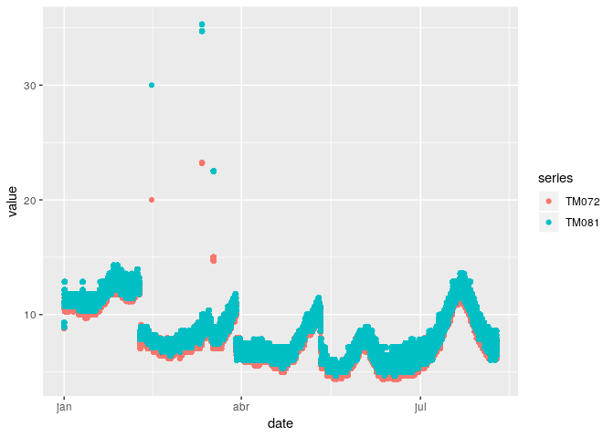
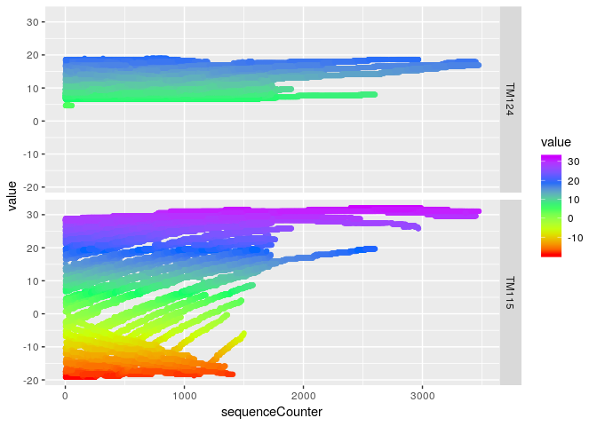
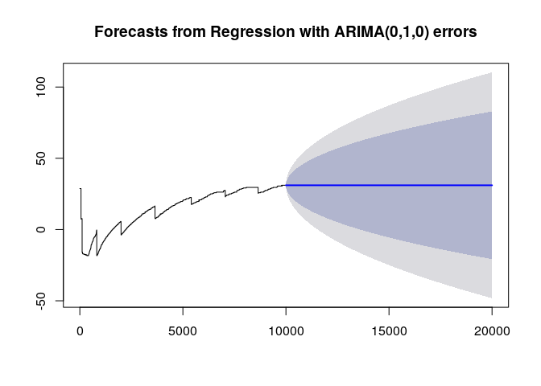
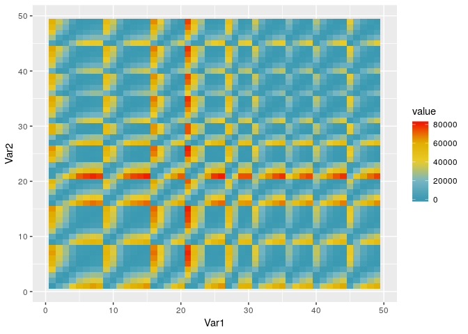

Satellite Telemetry temperature analysis
================
Yuri Matheus Dias Pereira
17/09/2018

This notebook displays an EDA on the satellite thermistor data.

``` r
library(data.table) # Table
```

    ## data.table 1.11.4  Latest news: http://r-datatable.com

``` r
library(lubridate) # Date
```

    ## 
    ## Attaching package: 'lubridate'

    ## The following objects are masked from 'package:data.table':
    ## 
    ##     hour, isoweek, mday, minute, month, quarter, second, wday,
    ##     week, yday, year

    ## The following object is masked from 'package:base':
    ## 
    ##     date

``` r
library(GGally) # ggplot2 convenience
```

    ## Loading required package: ggplot2

``` r
library(parallel) # Threads counts
library(fst) # File reading
```

    ## fst package v0.8.8

    ## (OpenMP detected, using 16 threads)

``` r
library(gridExtra) # Plot grids
library(tidyverse) # meta-package: everything else
```

    ## ── Attaching packages ────────────────────────────────── tidyverse 1.2.1 ──

    ## ✔ tibble  1.4.2     ✔ purrr   0.2.5
    ## ✔ tidyr   0.8.1     ✔ dplyr   0.7.6
    ## ✔ readr   1.1.1     ✔ stringr 1.3.1
    ## ✔ tibble  1.4.2     ✔ forcats 0.3.0

    ## ── Conflicts ───────────────────────────────────── tidyverse_conflicts() ──
    ## ✖ lubridate::as.difftime() masks base::as.difftime()
    ## ✖ dplyr::between()         masks data.table::between()
    ## ✖ dplyr::combine()         masks gridExtra::combine()
    ## ✖ lubridate::date()        masks base::date()
    ## ✖ dplyr::filter()          masks stats::filter()
    ## ✖ dplyr::first()           masks data.table::first()
    ## ✖ lubridate::hour()        masks data.table::hour()
    ## ✖ lubridate::intersect()   masks base::intersect()
    ## ✖ lubridate::isoweek()     masks data.table::isoweek()
    ## ✖ dplyr::lag()             masks stats::lag()
    ## ✖ dplyr::last()            masks data.table::last()
    ## ✖ lubridate::mday()        masks data.table::mday()
    ## ✖ lubridate::minute()      masks data.table::minute()
    ## ✖ lubridate::month()       masks data.table::month()
    ## ✖ lubridate::quarter()     masks data.table::quarter()
    ## ✖ lubridate::second()      masks data.table::second()
    ## ✖ lubridate::setdiff()     masks base::setdiff()
    ## ✖ purrr::transpose()       masks data.table::transpose()
    ## ✖ lubridate::union()       masks base::union()
    ## ✖ lubridate::wday()        masks data.table::wday()
    ## ✖ lubridate::week()        masks data.table::week()
    ## ✖ lubridate::yday()        masks data.table::yday()
    ## ✖ lubridate::year()        masks data.table::year()

``` r
library(magrittr)
```

    ## 
    ## Attaching package: 'magrittr'

    ## The following object is masked from 'package:purrr':
    ## 
    ##     set_names

    ## The following object is masked from 'package:tidyr':
    ## 
    ##     extract

``` r
library(forecast)
library(TTR)
library(dtw)
```

    ## Loading required package: proxy

    ## 
    ## Attaching package: 'proxy'

    ## The following objects are masked from 'package:stats':
    ## 
    ##     as.dist, dist

    ## The following object is masked from 'package:base':
    ## 
    ##     as.matrix

    ## Loaded dtw v1.20-1. See ?dtw for help, citation("dtw") for use in publication.

``` r
library(tidyquant)
```

    ## Loading required package: PerformanceAnalytics

    ## Loading required package: xts

    ## Loading required package: zoo

    ## 
    ## Attaching package: 'zoo'

    ## The following objects are masked from 'package:base':
    ## 
    ##     as.Date, as.Date.numeric

    ## 
    ## Attaching package: 'xts'

    ## The following objects are masked from 'package:dplyr':
    ## 
    ##     first, last

    ## The following objects are masked from 'package:data.table':
    ## 
    ##     first, last

    ## 
    ## Package PerformanceAnalytics (1.5.2) loaded.
    ## Copyright (c) 2004-2018 Peter Carl and Brian G. Peterson, GPL-2 | GPL-3
    ## https://github.com/braverock/PerformanceAnalytics

    ## 
    ## Attaching package: 'PerformanceAnalytics'

    ## The following object is masked from 'package:graphics':
    ## 
    ##     legend

    ## Loading required package: quantmod

    ## Version 0.4-0 included new data defaults. See ?getSymbols.
    ## Learn from a quantmod author: https://www.datacamp.com/courses/importing-and-managing-financial-data-in-r

``` r
library(timetk)
library(sweep)
library(wesanderson)
```

Reading the Data
================

Let's import the prepared telemetries and description:

``` r
root.dir <- '../'
source(paste0(root.dir, "R/reading_telemetry.R"))

# These are all the valid thermistor telemetries
# Date and CRC are needed
tms_th = c(
 'date', 'TM072', 'TM081', 'TM113', 'TM114', 'TM115', 'TM116', 'TM117',
 'TM118', 'TM119', 'TM120', 'TM121', 'TM122', 'TM124', 'TM126',
 'TM127', 'TM128', 'TM129', 'TM130', 'TM131', 'TM132', 'TM133',
 'TM134', 'TM135', 'TM136', 'TM137', 'TM138', 'TM139', 'TM140',
 'TM141', 'TM142', 'CheckCRC'
)

descriptions <- quick.read.tm.desc(root.dir)
telemetry.fst.path = build.file.path(
  root.dir = root.dir,
  file.name = '2018-01-01--2018-08-08-SAT2-TH.fst'
)
telemetries <- read.telemetry.fst(telemetry.fst.path)
```

Nice! Let's make some simple visualizations first.

``` r
simpleTelemTSPlot = function(data,
                             measures,
                             id.vars = 'date',
                             geom = ggplot2::geom_point,
                             scale.date = TRUE,
                             facet = TRUE) {
  # I know, repetition, but uses less memory than the full object
  data.melt = melt.data.table(
    data, id.vars = id.vars, variable.name = 'series',
    measure.vars = measures
  )
  data.plot = ggplot(
    data = data.melt,
    aes(x = date, y = value, colour = series)
  ) +
    geom()

  if (scale.date) {
    data.plot = data.plot +
      scale_x_datetime(
        date_breaks = "12 hours",
        date_labels = '%d-%m - %H:%M'
        ) +
      theme(
        axis.text.x = element_text(
          angle = 80, hjust = 1.0, vjust = 1.0
        )
      )
  }
  if (facet) {
    data.plot = data.plot +
      facet_grid(series ~ ., scales = 'free_y')
  }

  return(data.plot)
}
telemetries.valid = telemetries[CheckCRC == 'OK']
telemetries.invalid = telemetries[CheckCRC != 'OK']
```

@TODO: extract these common functions to a package or something

First, the two battery ones.

``` r
batteryTemps = c('TM072','TM081')
simpleTelemTSPlot(telemetries.valid, batteryTemps, scale.date = F, facet = F)
```



Generating these graphs is too damn slow.

Fitting to time series
======================

Ok, let's focus on the roadmap: - Get the data for the batteries into TS object - Try and make a smoothing operation on that (Moving average?) - Try to identify trends, if possible.

The hardest will be to fit the data to be able to perform analysis. Let's do that now!

``` r
tms = telemetries.valid[1:100000]
#sample.ts = telemetries.valid[, .(date,TM072)]
#sample.tss = ts(sample.ts)

#sample.tss2 <- sample.ts %>%
  # Complete the sequence
  #complete(date = seq(sample.ts[1]$date,sample.ts[.N]$date, by= .5)) %>%
  #as.data.table

#sample.tss2s = ts(sample.tss2[,-c('date')], deltat = .5)
#dcm.tss = decompose(sample.tss)
```

``` r
data.melt = melt.data.table(
  tms, id.vars = c('sequenceCounter', 'passageNum'),
  variable.name = 'series',
  measure.vars = c(
    'TM124', 'TM115'
  )
)

ggplot(
  data = data.melt,
  aes(x = sequenceCounter, y = value, colour = value)
) +
  geom_point() +
  facet_grid(series ~ .) +
  scale_color_gradientn(colours = rainbow(5))
```



ARIMA
-----

``` r
library(forecast)

tms10k = tms[1:10000]
tms.arima.fit = auto.arima(
  tms10k$TM115,
  seasonal = FALSE,
  xreg = fourier(ts(tms10k$TM115, deltat = .5), K = 1)
)
Xreg1 = seasonaldummy(ts(tms10k$TM115, deltat = .5))
plot(forecast(tms.arima.fit, h = 10, xreg = Xreg1))
```



...highly useless, need to account for the seasonality on this.

DTW
---

Small attempt using DTW, but it's very slow for anything big.

``` r
bigpassages = tms %>%
  group_by(passageNum) %>%
  count() %>%
  filter(n > 1000)

# Selects the biggest number of continous passages
tms.ts = tms %>%
  filter(
    passageNum %in% bigpassages$passageNum,
    sequenceCounter < min(bigpassages$n)
  ) %>%
  group_by(passageNum) %>%
  nest(.key = "data.tbl") %>%
  mutate(
    data.ts = map(
      .x = data.tbl,
      .f = ~ ts(.$TM115), # Only one as target for now
      deltat = .5
    )
  )

dtw.matrix = tms.ts$data.ts %>%
  map(.f = function(o.ts, data.ts) {
      map(.x = data.ts,
          .f = ~ dtw(., y = o.ts, distance.only = T)$distance
         )
    },
    data.ts = tms.ts$data.ts
  ) %>%
  unlist() %>%
  matrix(ncol = nrow(tms.ts), byrow = TRUE)
```

Now we have the distance between the most common parts of each passages! Let's check that out.

``` r
pal <- wes_palette("Zissou1", 100, type = "continuous")
dtw.matrix %>%
  melt() %>%
  ggplot(aes(Var1, Var2)) +
  geom_tile(aes(fill = value)) +
  scale_fill_gradientn(colours = pal)
```


