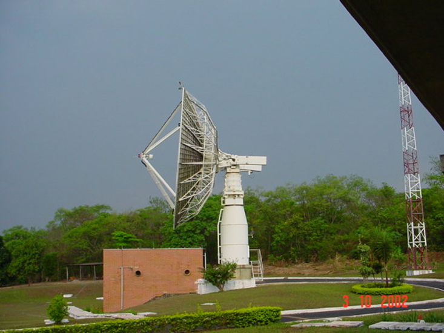

```{r setup, include=FALSE}
options(htmltools.dir.version = FALSE)
library(DT)
library(tidyverse) # meta-package: everything else
library(data.table) # Table
library(lubridate) # Date
library(GGally) # ggplot2 convenience
library(parallel) # Threads counts
library(fst) # File reading
```

# Satellite Operations

.pull-left[
- Satellite Control Center - **CCS/INPE**
 - SCD1 & SCD2
 - CBERS
 - Amazônia

What about the data?
- **Besides** the payload
- Telemetry/Housekeeping for the operators
- Satellite -> Ground Station -> Satellite Control Center
]

.pull-right[
```{r cuiaba, fig.align='left', out.width='100%', echo = FALSE}

```
]

---

# Telemetry Data

- Satellites in general have hundreds or thousands of telemetries.
    - Hubble generated **3TB** of telemetries per year!<sup>1</sup>
- Useful only for operations and engineering.
- Mostly numerical, with some bit masks.
- Analysis is performed to see if the satellite will continue to perform its duties as it should.
- Engineering checks the values for subsystems health monitoring.
    - Important to know if the satellite will continue to work in the future
    - Or if it will exceed the expected lifetime

.footnote[
[1] Miebach, M. P. (may 1998). Hubble Space Telescope: Cost reduction by re-engineering telemetry processing and archiving.
]

---

# Telemetries Information

```{r data, echo = FALSE, include=FALSE}
ROOT_DIR = '../../'
source(paste0(ROOT_DIR, 'R/reading_telemetry.R'))

telemetries.desc <- quick.read.tm.desc(ROOT_DIR)
telemetries <- quick.read.tm(ROOT_DIR)
```

```{r telemetriesDT, echo=FALSE}
selected.columns = telemetries.desc[,.(ID, DESCRIPTION, EQP, SYSTEM, RANGE, ACCURACY)]
DT::datatable(
  selected.columns,
  options = list(pageLength = 5)
)
```

---

# What I got.

- One satellite, hundreds of telemetries.
- Raw telemetries from `2014~2018` total about **~45GB** of **csv**
- Requires a database to work with everything on R...
- I'll focus on a single month of data (enough!)
    - `~345MB` of *csv* data
    - For R:

```{r}
format(object.size(telemetries), units = "auto", standard = "SI")

dim(telemetries)
```

---

# A look into the data

```{r dataDT, echo=FALSE}
selected.columns = head(telemetries[,c(1, 2, 29, 27)], n = 50)
DT::datatable(
  selected.columns,
  options = list(pageLength = 5)
)
```

---

# An image is worth a thousand words

```{r validInvalid, echo = FALSE}
telemetries.valid = telemetries[CheckCRC != 'Erro']
telemetries.invalid = telemetries[CheckCRC == 'Erro']
telemetries.pss.pcu.temp = c('TM072', 'TM081')
telemetries.mge.600 = telemetries.desc[EQP == 'MGE'][1:3]$ID

plotData = function(data, measureVars)
{
    telemetries.melt = melt.data.table(
        data, id.vars = 'date', variable.name = 'series',
        measure.vars = measureVars
    )

    plotResult = ggplot(
        data = telemetries.melt,
        aes(x = date, y = value, colour = series)
    ) +
        geom_point() +
        scale_x_datetime(date_breaks = "12 hours", date_labels = '%d-%m - %H:%M') +
        theme(axis.text.x = element_text(angle = 45, vjust = 1.0, hjust = 1.0))
    return(plotResult)
}
```

```{r telem, center = TRUE, fig.width=13, cache=TRUE}
plotData(telemetries, telemetries.mge.600)
```

---

# What to do from here?

- Data Product
    - Anomaly Analysis -> Outlier Identification
    - Single variable
        - Cross recurrence quantification analysis
    - Multiple variables rule induction methods
        - Can unearth unseen patterns for engineering
    - Time Series modeling
        - Make stationary, try and see for trends
        - Also useful for outliers
        - ARIMA? SARIMA? Derivatives?

## For now...

- A combination of some ideas
    - *Data Imputation*
- How much useful data is lost in telecommunication?
- CRC Check

---

# CRC Idea

```{r checkCRC, center = TRUE, fig.width=13, cache=TRUE}
plotData(telemetries, telemetries.pss.pcu.temp)
```

---

# Only valid data

```{r checkCRCValid, center = TRUE, fig.width=13, cache=TRUE}
plotData(telemetries.valid, telemetries.pss.pcu.temp)
```

---

# Only invalid data

```{r checkCRCInvalid, center = TRUE, fig.width=13, cache=TRUE}
plotData(telemetries.invalid, telemetries.pss.pcu.temp)
```

---

# Other ideas

- Data Science is essential for operations
    - So is artificial intelligence
- Less cost with operators:
    - Unfeasible to have one dedicated operator per satellite when you have *constellations*.
    - Sheer amount of future projects require some level of automation.
    - Other space operators have been doing it for *decades*.

## Problems

- Data *can't* be public
- Hard to get raw telemetry data
- Historic data is sometimes stashed away (tapes!)

---

class: inverse, middle, center

# Thank you!

---

class: inverse, middle, center

# Questions? Ideas?

---

# Extras

Slides created using Xaringan [**xaringan**](https://github.com/yihui/xaringan).
